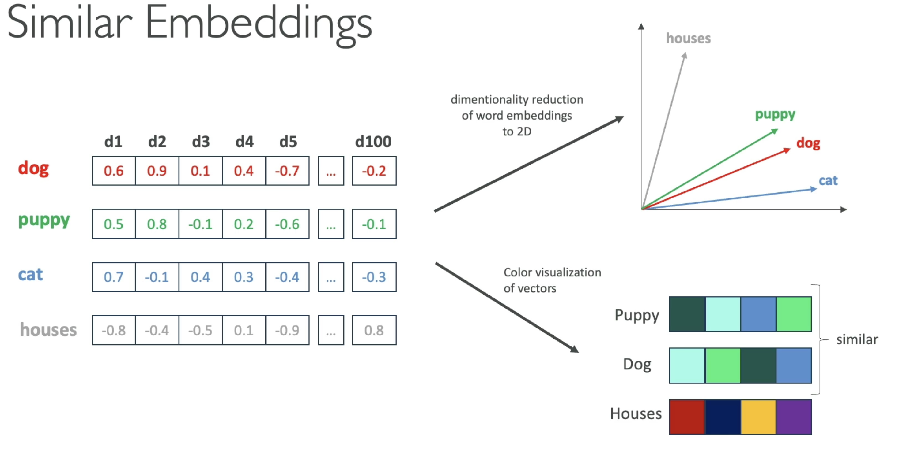

# Transformer

- It's a kind of `neutral network` (machine learning model) that is used as technique/process to `Foundation Models`
- Originally invented by Google 2017 for the google translate
- Examples
  - `Text-to-Text`
    - Text generators
    - Next word prediction
  - `Voice-to-Text`
    - Transcripts
  - `Text-to-Voice`
    - Voice generators
  - `Text-to-Image`
    - Image generators
    - Stable Diffusion, Dall-E, Midjourney

## Steps

### Tokenization

- Break down of the text (or the prompt) into small pieces called `tokens`
- Tokens can be a word, a chunk of a sound, patches of an image
- Each tokens is associated with a `vector` (or a tensor) that encodes the meaning of the token
- <https://platform.openai.com/tokenizer>

### Embedding Tensor

- **Embedding a word**: It's be process of encoding an input (text, image, audio) into a vector (array of numerical values) with multiple dimensions (100s)
  - This process is performed by an `embeddings model`
- All the embeddings are stored in a `vector database`
- Data (e.g., words) that have a semantic relationship have similar embeddings
- It's hard to visualize multiple dimensions, so sometimes `dimensionality reduction` is applied to the vector to visualize it in 2D or 3D

- $W_E$ is the initial tensor that will be refined until the result is found
  - For word prediction models, the embedding tensor is composed of vectors represented every single possible word
- This embedding tensor is multiplied by each vector to produce the first layer

### Attention

- The vectors pass through an operation called `Attention block` in which the vectors exchange information with each other in order to adjust its values/weights.
  - E.g., words that tend to appear together side-by-side, words with different meaning depending on the context

### Multilayer perceptron (Feedforward layer)

- In this phase the vectors don't talk to each other
- The objetive is to fine tune the meaning of the vector (it's value)
- The values are adjusted according to a series of questions that are asked for each vector
  - E.g., is it english? is it a noun? does it refer to a person?
- This operation can be parallelized on GPUs!

### \<Repeat\>

- Steps `attention` and `multilayer perceptron` are repeated multiple times
- The final result is a last vector that represents the probability distribution of the next possible `token`
- The whole process can be repeated from the start including the new token and with that a complete goal can be generated (a sentence, an image, etc)
