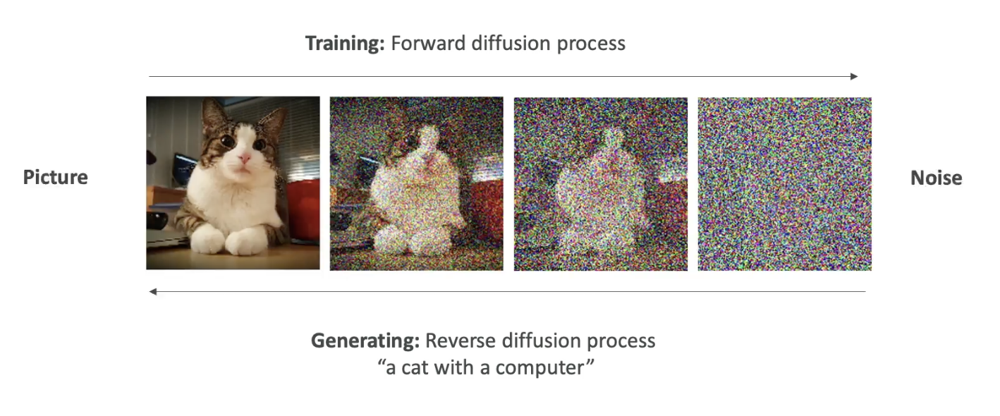

# Diffusion Models

- They are `Text To Image` models
- Trains using a `forward diffusion process`
  - Adds noise to the image
- Generates image from noise
  - Reverse the `diffusion process`

## Providers

- Model: `Stable Diffusion`, Provider/Company: `Stability AI`
- Model: `Midjourney`, Provider/Company: `Midjourney` <https://www.midjourney.com/> (got famous on discord)
- Model: `Dall-E`, Provider/Company: `OpenAI`
