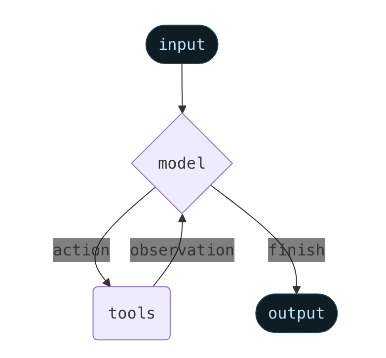

# Agentic Loop

- Agents combine the `models` with `tools`
- Agents reason about tasks, decide which tools to use and work towards a solution
- <https://docs.langchain.com/oss/python/langchain/agents>

- The `langchain.agents.create_agent` function build a `graph-based` agent runtime using `LangGraph`
  - It consists of nodes (steps) and edges (connections) that defines how your agent processes information

## Evolution of the Agentic Loop

1. **ReAct Prompt with AgentExecutor** (2022~mid-2023)
    - `create_react_agent` & `AgentExecutor`
    - Prompt with the reasoning format (Thought/Action/Observation), tool descriptions and output instructions
    - The AgentExecutor ran the loop: call LLM, parse output, tool calls, append observations, repeat

2. **Tool Calling with AgentExecutor** (mid-2023~2024)
    - `create_tool_calling_agent` & `AgentExecutor`
    - OpenAI introduced function calling (June 2023)
    - Use the [function calling](https://developers.openai.com/api/docs/guides/function-calling) functionality of LLMs (made available in June 2023) that also support the [structured output](https://developers.openai.com/api/docs/guides/structured-outputs)
    - AgentExecutor still orchestrated the loop

3. **Tool Calling with LangGraph**
    - `create_agent` (langchain 1.0)
    - LangGraph allowed agents with graphs/state machines, not hidden loops
