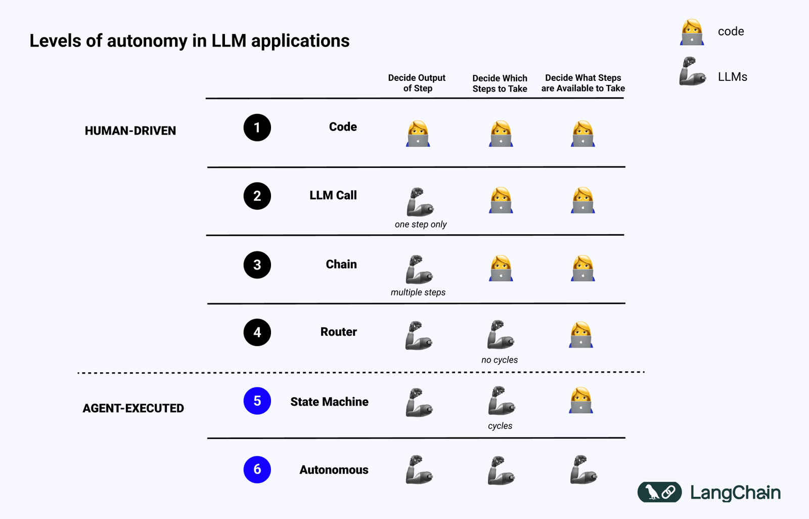

# LangGraph

- It helps managing the memory <https://docs.langchain.com/oss/python/langgraph/memory>
  - Example: supports trimming old messages
- In LangGraph, the flow (composed by the steps in the application) is represented by a graph (or a state machine)
- Flow Engineering: having a graph to guide the AI application on the steps to take

## Levels of autonomy in LLM applications

- <https://blog.langchain.com/what-is-a-cognitive-architecture/>

- `LangGraph` and the `ReAct Agent` is positioned as a State Machine
