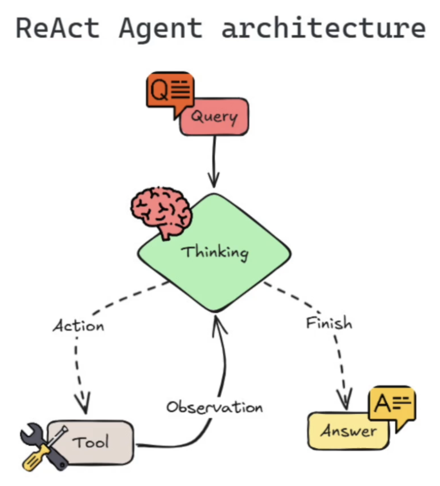

# ReAct Prompt

- `Reason-Act`
- This is a legacy prompt was used before the `tools` API was implemented in several LLMs
- This prompt was derived from the paper `ReAct: Synergizing Reasoning and Acting in Language Models` (2023): <https://arxiv.org/abs/2210.03629>
- ReAct combines `CoT` (Reason) with `tool calling` (Action)



```txt
Answer the following questions as best you can. You have access to the following tools:

{tools}

Use the following format:

Question: the input question you must answer
Thought: you should always think about what to do
Action: the action to take, should be one of [{tool_names}]
Action Input: the input to the action
Observation: the result of the action
... (this Thought/Action/Action Input/Observation can repeat N times)
Thought: I now know the final answer
Final Answer: the final answer to the original input question

Begin!

Question: {input}
Thought:{agent_scratchpad}
```

```txt
Thought: To get the weather for São Paulo, I need to call the get_weather function with the city name as an argument.
Action: get_weather
Action Input: São Paulo
```

- ... then the agent would parse this response, execute the tool and append the Observation to the prompt

```txt
Final Answer: The current weather in São Paulo is sunny.
```
