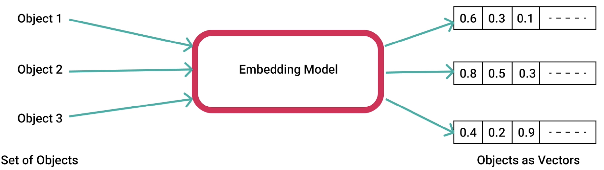
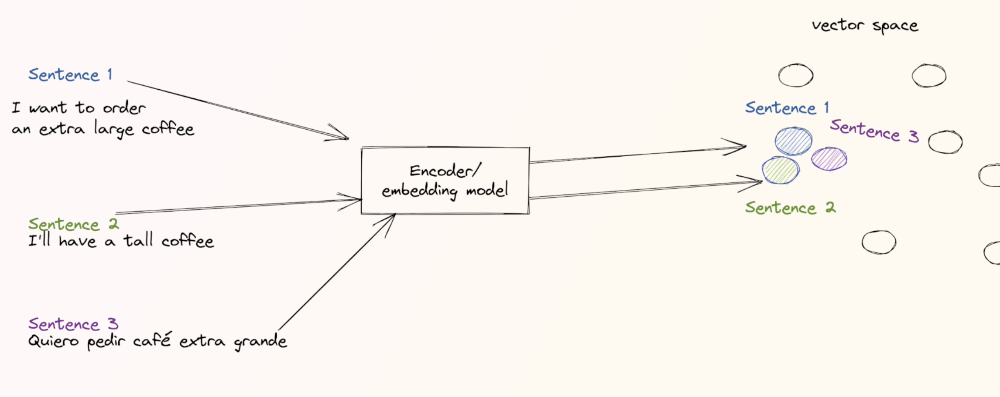

# Embeddings

- It's a `vector` (or an "embedding") created out of a object/text that represents the position this object in a high-dimension space
- An `embedding model` is used to create the vector/embedding of an object
- The distance between points (the objects) in this high-dimension represent how similar they are to each other.
- "How similar it is" can be how similar are the `semantic meanings` of the objects
- Embeddings are specially useful for RAG and searching by meaning

