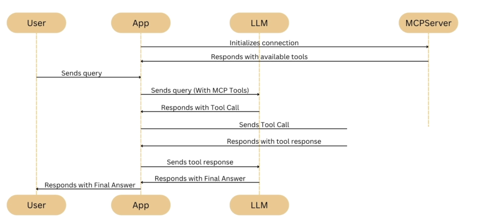

# Model Context Protocol (MCP)

- <https://modelcontextprotocol.io/docs/getting-started/intro>
- Standardizes how AI systems (like LLMs) connect with external tools and data sources
- Launched by Anthropic in December 2024
- It's connector between the LLM models and the context in which it needs to operate (the outside world)
- Key features
  - Portability: You don't need to rewrite integrations for each LLM vendor.
  - Security: It standardizes permissions and sandboxing, so agents don't get unrestricted access.
  - Ecosystem: Third-party developers can build MCP "servers" (tools, connectors) that any AI app can use.
- Official servers: <<https://github.com/modelcontextprotocol/servers>>

## Architecture

- `MCP Client`: The AI model or chat interface (Claude Desktop, VS Code plugin, etc.).
- `MCP Server`: The external tool/service you want the AI to access (e.g., GitHub repo, Postgres DB, Jira).
- `MCP Protocol`: Defines how the client and server exchange messages (structured JSON).



## Server Capabilities

- **Tools**
  - Functions are invoked by the LLM
  - E.g., send message, update db, search, etc
- **Resources**
  - Resources are exposed to the application (the client)
  - Can be static or dynamic
  - E.g., Files, DB Records, API Responses
- **Prompts**
  - Pre-defined templates for AI interactions
  - Documentation Q&A, Transcript Summary, Output as JSON

## Runtime

- `Locally`: stdin/stdout
- `Remotelly`: SSE or HTTP

## MCP Inspector

- Helps troubleshooting a MCP server
- <https://modelcontextprotocol.io/docs/tools/inspector>
- <https://github.com/modelcontextprotocol/inspector>

```shell
npx @modelcontextprotocol/inspector # connect later to a mcp server e.g., https://docs.langchain.com/mcp
npx @modelcontextprotocol/inspector <command> # start a server stdio
```

## MCP config

```json
// Claude Code (~/.claude.json)
{
  "mcpServers": {
      "mymcp": {
        "type": "http",
        "url": "https://docs.langchain.com/mcp"
      }
  }
}
```
