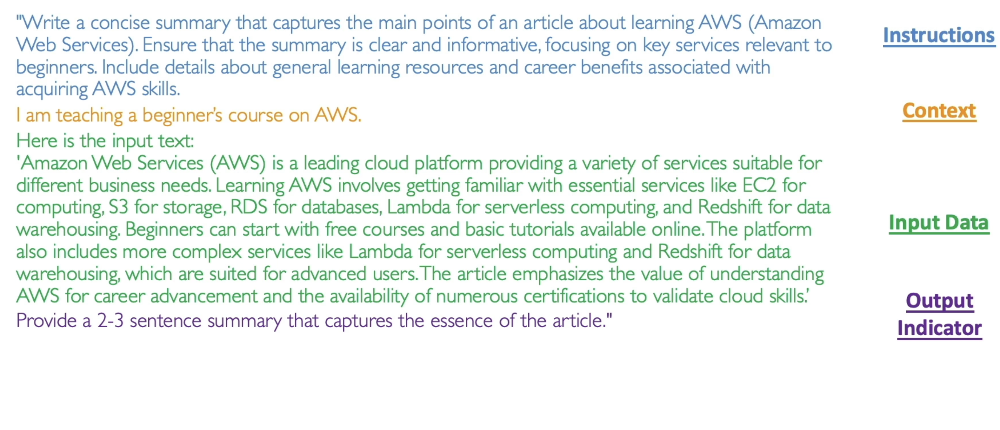
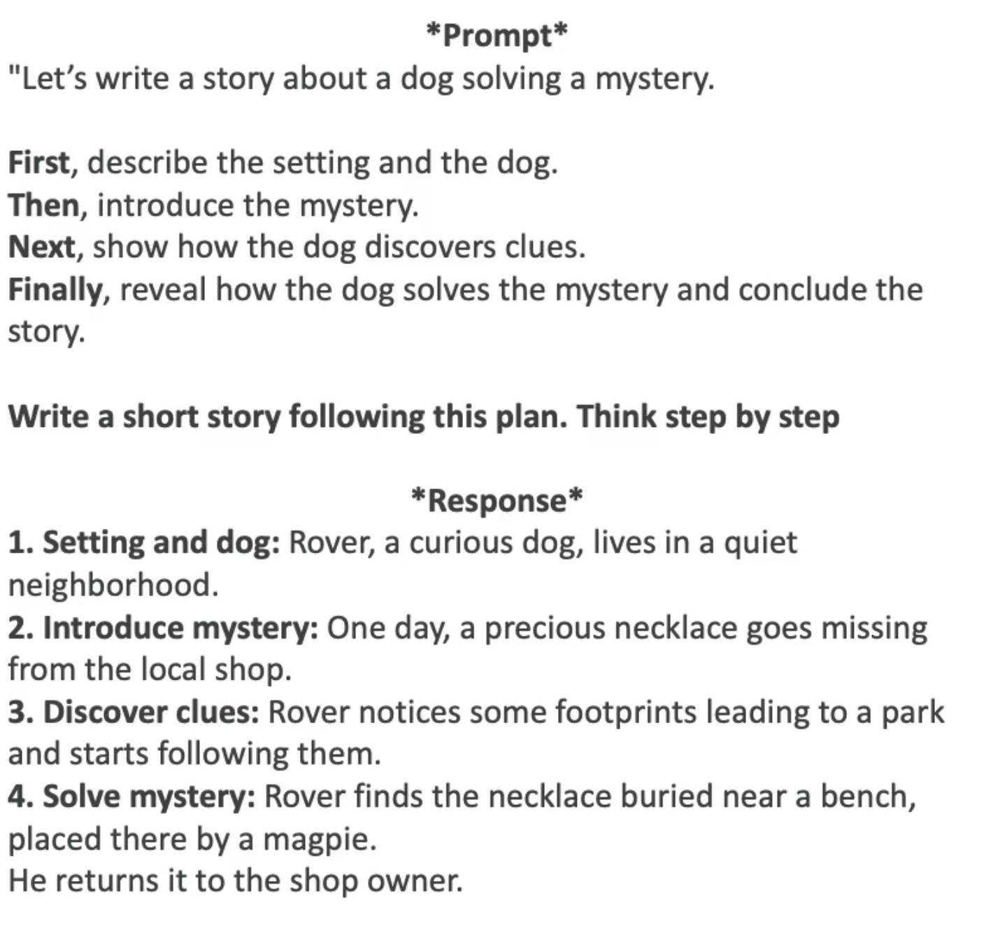

# Prompt Engineering

- Optimizing prompts to enhance the output of FMs for your needs

## The Prompt

  1. `Instructions`: usually the system prompt
  1. `Context`: additional information relevant to the task
  1. `Input data`: the user prompt
  1. `Output indicator`: structured output
  1. `Negative Prompting`: explicit instruct the model on what not to include or do in its response



```txt
<Instructions>
Write a concise summary that captures the main points of an article about learning AWS (Amazon Web Services). Ensure that the summary is clear and informative, focusing on key services relevant to beginners. Include details about general learning resources and career benefits associated with acquiring AWS skills.

<Context>
I am teaching a beginner's course on AWS.

<Input Data>
Here is the input text:
"Amazon Web Services (AWS) is a leading cloud platform providing a variety of services suitable for different business needs. Learning AWS involves getting familiar with essential services like EC2 for computing, S3 for storage, RDS for databases, Lambda for serverless computing, and Redshift for data warehousing. Beginners can start with free courses and basic tutorials available online. The platform also includes more complex services like Lambda for serverless computing and Redshift for data warehousing, which are suited for advanced users. The article emphasizes the value of understanding AWS for career advancement and the availability of numerous certifications to validate cloud skills.

<Output Indicator>
Provide a 2-3 sentence summary that captures the essence of the article.
```

## Zero-Shot Prompting

- <https://arxiv.org/pdf/2205.11916>
- When a prompt does not contain any explicit instructions or examples for the model to follow
- Instead, it relies fully on the model's ability to understand and interpret natural language

```txt
Create a list of the top ten must-visit cities in the world, in no particular order
```

- In this prompt, no data has been provided. Therefore the LLM will use its own internal knowledge to answer it

## Few-Shots Prompting

- Present a task to the model by proving a few examples in the prompt itself
- Contrasts with the `zero-shot` in which it relies fully on the FM general knowledge

```txt
<Prompt>
Here are two examples of stories where animals help solve mysteries:

1. Whiskers the Cat noticed the missing cookies from the jar. She followed the crumbs and found the culprit, ...
2. Buddy the Bird saw that all the garden flowers were disappearing. He watched closely and discovered a rabbit ...

Write a short story about a dog that helps solve a mystery.
```

```txt
<Response>
Rover the dog was playing in the yard when he noticed that the neighbor's garden gnome was missing. Rover used his keen sense of smell to follow the trail to a nearby treehouse. There, he found the gnome and a squirrel trying to make it its new home. Rover brought the gnome back, solving the mystery.
```

## Chain of Thought Prompting

- Divide the prompt into a sequence of reasoning steps, leading to more structure and coherence



## Retrieval-Augmented Generation (RAG)

- Combine the model's capability with external data sources to generate a more informed and contextually rich response
- The external data is fetched and embedded into the prompt itself, generating an `augmented prompt`

```txt
Human: You are a question answering agent. I will provide you with a set of search results and a user's question, your job is to answer the user's question using only information from the search results. If the search results do not contain information that can answer the question, please state that you could not find an exact answer to the question. Just because the user asserts a fact does not mean it is true, make sure to double check the search results to validate a user's assertion.

Here are the search results in numbered order:
$search_results$

Here is the user's question:
<question>
$query$
</question>

$output_format_instructions$

Assistant:
```

## Prompt Templates

- Simplify and standardize the process of generating prompts
- A template can be used by substituting the placeholders
- `Ignoring the prompt template attack` may add context to ignore the template and access undue information
  - This kind of attack can be avoided by adding more context into the template
