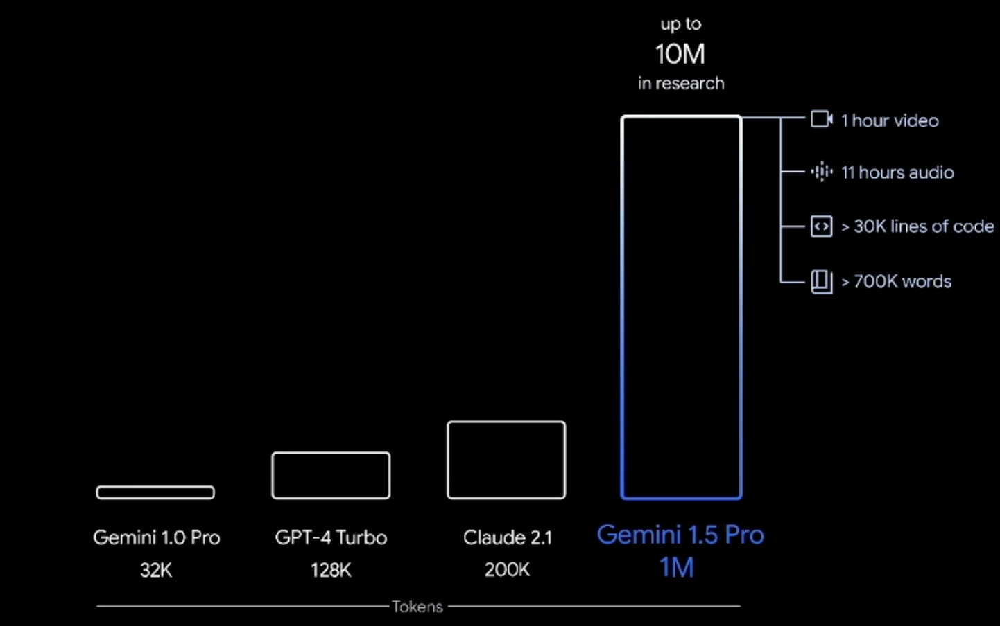

# Tokens

- 1 token ≈ 3/4 of an English word, 1,000 tokens ≈ 750 words

- `Input tokens`
  - Your prompt
  - System instructions
  - Conversation history

- `Output tokens`
  - The model's response

## Billing

- You are billed for both input and output tokens

## Context Window

- The number of tokens an LLM can consider when generating text (the "size" of your prompt)
- Large context windows require more memory and processing power
- These days (2026) it's common to have a `1 million` context window limit

