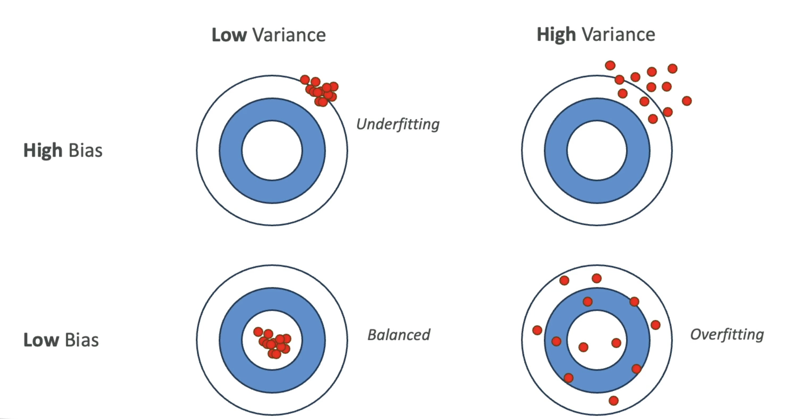
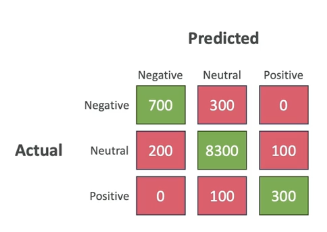
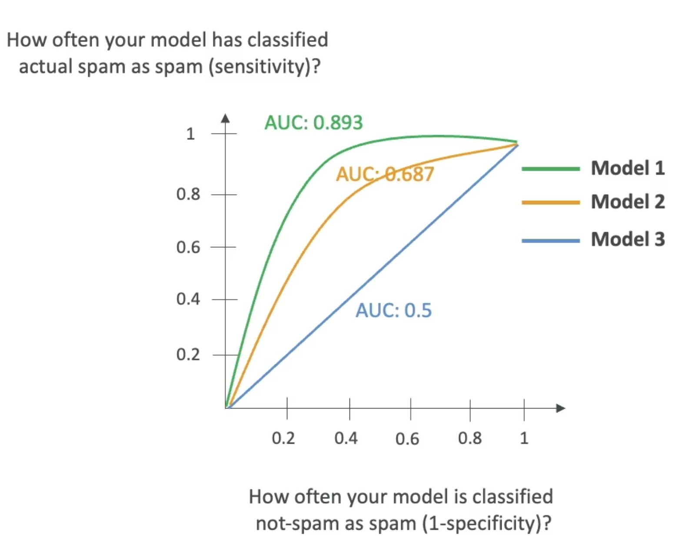

# Model performance

## Model Fit, Bias and Variance

- **Model Fit**
  - `Overfitting`: models performs well on the training data, but not on the evaluation data
    - Reasons: training data size too small, model trained for too long on a single sample set of data, model complexity is too high (learns from noise)
  - `Underfitting`: model performs poorly on the training data
  - `Balanced`: neither overfitting or underfitting

- **Bias**
  - Difference between predicted and actual value
  - High bias is bad! E.g., linear regression for a non-linear dataset
  - Reduce bias by increasing the number of features

- **Variance**
  - How much the performance of the model changes if trained on a different dataset which has a similar distribution
  - Reduce variance by feature selection (less, more important features)

## Model Evaluation Metrics

### Binary Classification

- E.g., spam/not spam
- It's evaluated with a `confusion matrix`
- True positives (TP), True negatives (TN), False positives (FP), False negatives (FN)
- In an `imbalanced dataset` FP and FN have different weights (e.g., a FN spam is much worse than FP spam)

$$Precision = \frac{TP}{TP+FP}$$

$$Recall = \frac{TP}{TP+FN}$$

$$F1 = \frac{T2*Precision*Recall}{Precision+Recall}$$

### AUC-ROC

- `Area Under Curve` - `Receiver Operator Curve`
- Value from 0 to 1 (1 is perfect model)
- Uses `sensitivity` (TP rate) and `I-specificity` (FP rate)
- AUC-ROC shows what the curve for TP compared to FP looks like at various thresholds

### Regression Metrics

These are metrics used for evaluating models that predict a continuous value

- `MAE`: Mean Absolute Error
  - Between predicted and actual values

$$MAE = \frac{1}{n} \displaystyle \sum_{i=1}^n |y_i - \overline{y_i}|$$

- `MAPE`: Mean Absolute Percentage Error

$$MAPE = \frac{1}{n} \displaystyle \sum_{i=1}^n |\frac{y_i - \overline{y_i}}{\overline{y_i}}|$$

- `RMSE`: Root mean squared error

$$RMSE = \sqrt{\displaystyle \sum_{i=1}^n \frac{(\overline{y_i} - y_i)^2}{n}}$$

- `R Squared`
  - Explains variance in your model
  - $Rˆ2$ close to 1 means predictions are good
