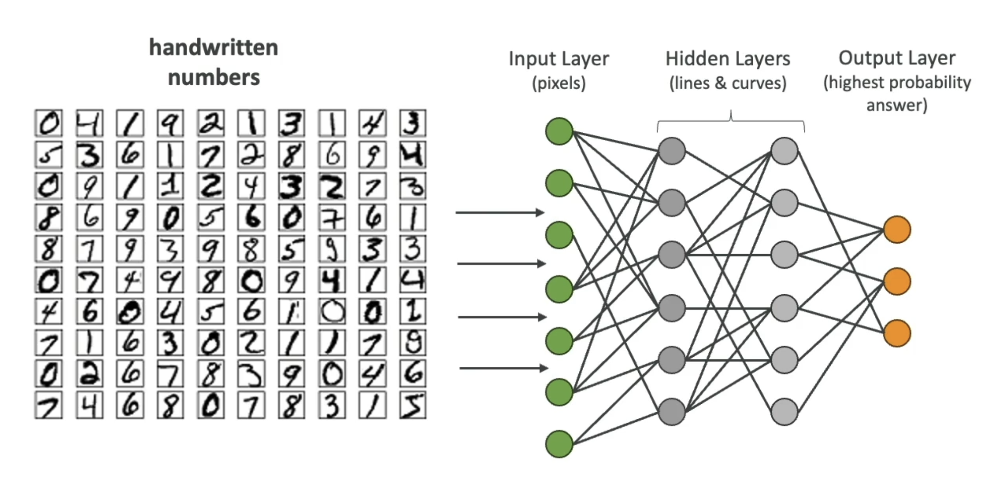

# Types

## SVM (Support Vector Machine)

- Used for regression and classification

## Transformers

## Neural Networks

- Neural networks may have billions of nodes
- As more input data is added, the connections and weights between the nodes are adjusted

## Convolucional Neural Networks (CNN)

## RNN (Recurrent Neural Network)

- Meant for sequential data such as `time-series`
- Useful in
  - Speech recognition
  - Time-series predictions

## Multilayer Perceptrons

## ResNet (Residual Network)

- Specialized deep CNNs
- Useful for
  - Image recognition
  - Object detection
  - Facial recognition

## WaveNet

- Model to generate raw audio waveform
- Used in speech synthesis

## GAN (Generative Adversarial Network)

- Models used to generate synthetic data such as images, videos or sounds
- The synthetic data resembles the training data
- Helpful for data augmentation

## XGBoost (Extreme Gradient Boosting)

- An implementation of gradient booting
- Used for regressions
