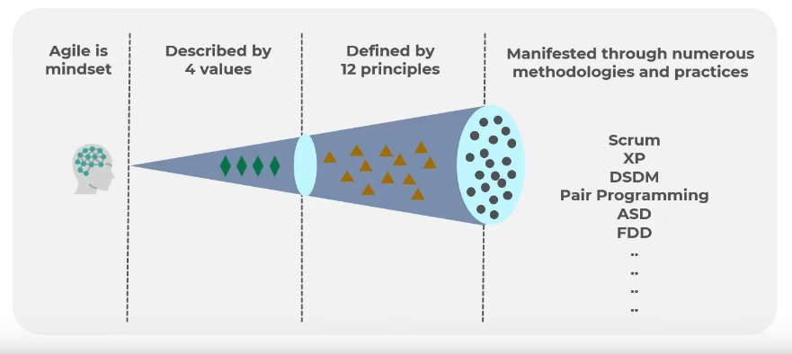
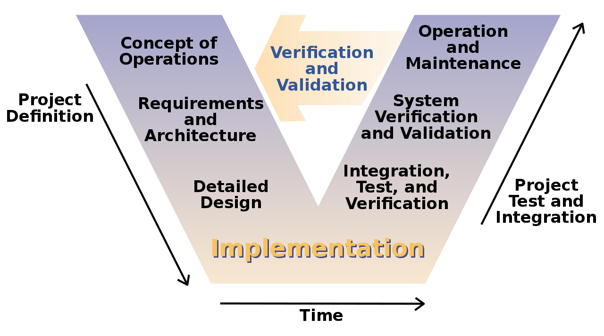
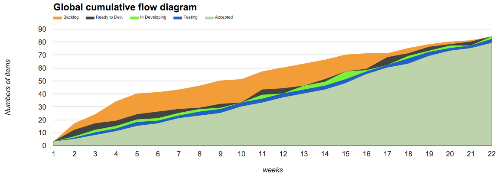

# Agile

- Organization practicing agile

  - `Software Development`: 37%
  - `IT`: 26%
  - `Operations`: 12%
  - `Marketing`: 7%
  - `HR`: 6%
  - `Sales`: 5%

- Benefits
  - Manage changing priorities
  - Project visibility
  - Business/IT Alignment
  - Delivery Speed & Time to market
  - Team morale
  - Increased team productivity
  - Project risk reduction
  - Project predictability
  - Software quality
  - Engineering discipline
  - Managing distributed teams
  - Software maintainability
  - Project cost reduction

## Agile Manifesto Values

- Agile is a mindset

- There are `4 values` for the agile mindset

1. **Individuals and interaction** over processes and tools
1. **Working software** over comprehensive documentation
1. **Customer collaboration** over contract negotiation
1. **Responding to change** over following a plan

- These values are further described into `12 principles`

## Agile Methodology

- `Iterative` approach to software development
- `Small cycles` referred as `sprints` or `iterations`
- With every iteration new features are added to the product
- Small, self-organizing teams of `software developers` and `business representatives`

## Agile at Scale

- `Vertical Scaling`: integrate the work of multiple teams into a single product
- `Horizontal Scaling`: apply agile mindset at other departments (hr, sales, finance, etc)

- `SAFe` (Scaled Agile Framework) is a popular scaling method

## Agile Tools

### KPI

- Assessment

### Scrum

- Built on
  - Transparency
  - Inspect
  - Adaption
  - Short learning cycles
- Flow
  - Iteration planning
  - DSU: daily stand up

### Kanban

- Board with `todos`
- `Classes of service` (CoS): level of urgency of the items
  - Expedite: critical priority
  - Fixed Date: high cost of delay
  - Standard: moderate cost of delay
  - Intangible: no cost of delay

### Extreme Programming

- Test-driven Development
- Collective Ownership
- Coding standards
- Automated testing
- Pair work
- Simple Design
- Refactoring
- Continuous Integration
- User Stories

### V-Model

- Write feature
- Write Story
- Write Code
- Test-Code

### Cumulative Flow Diagram

- Example 1
  - Backlog
  - Ready to Dev
  - Developing
  - Testing
  - Accepted
- Example 2
  - In development
  - In code review
  - Waiting for QA
  - In QA review
  - Waiting for review
  - Done

- `lead time breakdown`: latency between start and end
