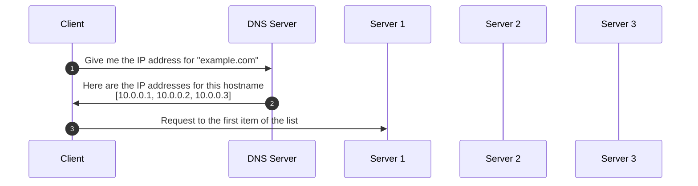
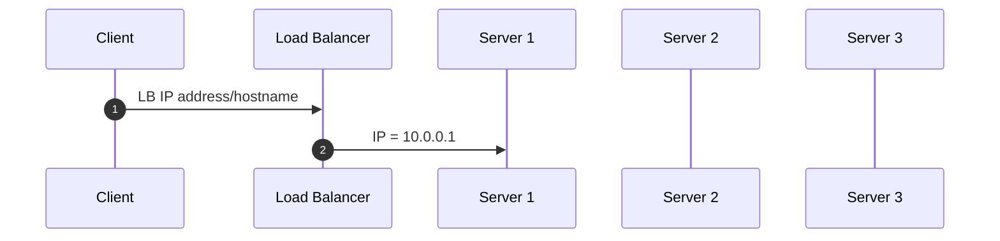
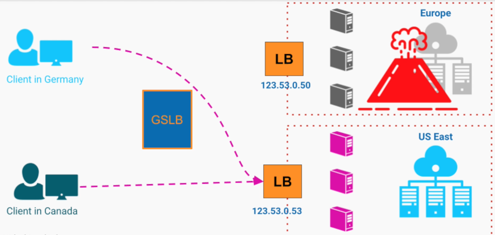

# Load Balancer

- A LB `spreads load evenly` across multiple downstream instances
- Makes the entire system to look like a single server, so that the client need to know only one IP address

## LB Quality Attributes

- **Scalability**
  - Allows easily adding/removing more servers to/from the "pool"
  - Allows the implementation of auto-scaling based more metrics (e.g., req/s, network bandwidth, etc)

- **High Availability**
  - Remove automatically faulty servers from the pool based on metrics (e.g., error rate, hearth-beat/health-check)

- **Performance**
  - Allows a higher throughput by having multiple servers in the pool

- **Maintainability**
  - Easily add/remove servers to the pool
  - Servers can be taken off for maintenance while the others are still serving (`rolling release`)

## LB Types

### DNS Servers

- The DNS server can return a list of IP addresses corresponding to each server
- This list can have a different order on each request so that the each client may pick a different host (usually the first item in the list)
- The list of IP addresses is changed on the client with a configured TTL

- **Pros**
  - It's cheap because it comes for free when purchasing a domain name
- **Cons**
  - Doesn't come with health checks
  - Doesn't have further strategies beyond round-robin
  - The client gets the IP addresses of the servers (exposes implementation details and make it less secure)

### Hardware & Software LB

- `Hardware LB`: Run on dedicated servers designed and optimized for load balancing
- `Software LB`: Programs that run on general-purpose computers to perform load balancing

- This type of LB has to be located close to the actual servers (same region, same availability zone), otherwise a high response time will be added to the requests

- **Pros**
  - Actively monitor the health of the instances
  - Loads the traffic more smartly (e.g., consider the load on the server, number of open connections, etc)
- **Cons**
  - Requires additional setup
  - More expensive
  - It still requires a DNS

### GSLB (Global Server LB)

- A mix of Hardware/Software LB + DNS server
- Make even smarter routings depending on the client
  - E.g., if the client is in Europe, return the IP address of the closest LB located in Europe
- GSLB can also return a list of LBs in a particular region so the client decides which to pick
- The actual request and connection is established directly with the local LB (not proxied by the GSLB), the GSLB functions just as a smart DNS
- `GSLB strategies`
  - Physical location
  - Best estimate response time
  - CPU load in each region/data center
- Plays a important role in `failovers` and `disaster recovery` situations

## Implementations

- Open Source
  - **HAProxy**
  - **NGINX**
    - HTTP server & reverse proxy (load balancer)

- Cloud Based
  - **AWS Elastic Load Balancing**
  - **CGP Cloud Load Balancing**
  - **Azure Load Balancer**
  - GSLB
    - **AWS Route 53**
    - **GCP Cloud DNS**
    - **Azure Traffic Manager**
