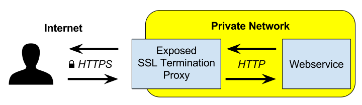
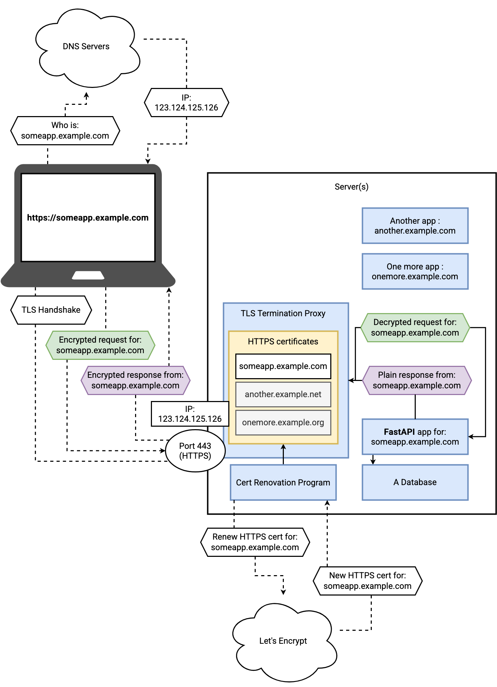

# TLS Termination Proxy

- <https://en.wikipedia.org/wiki/TLS_termination_proxy>
- A `TLS termination proxy` (or SSL offloading) is a proxy server that acts as an intermediary point between client and server applications, and is used to terminate and/or establish TLS tunnels by decrypting and/or encrypting communications before it reaches your application.
- This is different from TLS pass-through proxies that forward encrypted TLS traffic between clients and servers without terminating the tunnel.

## Services

- `Traefik` (natively handles certificate renewals)
- `Caddy` (natively handles certificate renewals)
- `Nginx` (+ Certbot for certificate renewals)
- `HAProxy` (+ Certbot for certificate renewals)
- `Nginx Kubernetes Ingress Controller` (+ cert-manager for certificate renewals)

## Workflow

- The TLS certificates are associated with a domain name, not with an IP address

