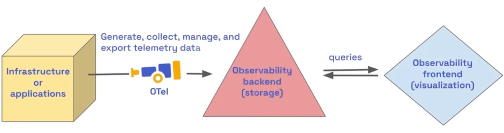

# OpenTelemetry (OTel)

- <https://github.com/open-telemetry>
- Facilitate the `generation`, `export`, `collection` and `management` of telemetry data (`instrumentation`)
- It's not a observability backend (storage) or frontend(visualization)
- Avoids vendor lock-in

## Metrics

- Collects application and system metrics and can export them to backends like:
  - Prometheus: For scraping and storing metrics.
  - Grafana Cloud: For visualization.

## Logs

- Gathers logs from applications and forwards them to logging systems, such as:
  - Fluentd or Loki: For processing and storage.
  - Elasticsearch: For querying and analysis.

## Traces

- Provides tracing data to visualize and analyze the flow of requests across distributed services, exporting this data to:
  - Grafana Tempo (for tracing).
  - Other tracing backends like Jaeger or Zipkin.

## Visualization

- Grafana can connect to telemetry data exported by OpenTelemetry to display metrics, traces, and logs on unified dashboards.
