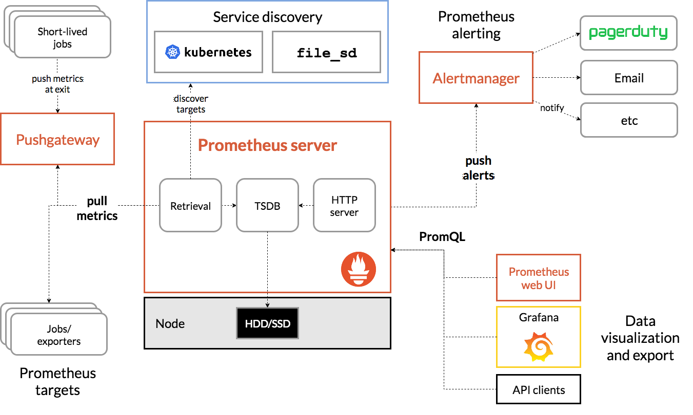

# Prometheus

- Launched by SoundCloud in 2012
- The de facto `standard data model for metrics`
- It's a `time-series database (TSDB)` + a `scraper` + a `query language`, all in one binary
- Uses a pull-model (scraping)

## Components

- **Retrieval**
  - Worker that pulls the metrics data
  - Pulls from HTTP endpoints
  - Default endpoint for the service: `{host}/metrics`
  - The target must `expose` this /metrics route
  - The metrics must be exposed in the correct format
  - For services that do not expose /metrics by default it needs an `exporter` (to format and expose the metrics)
  - For `short-lived jobs` the application push then into a `pushgateway` and prometheus scrapes from the pushgateway

- **Storage**
  - Prometheus is deliberately simples about storage
  - A single prometheus server
  - Stores data on local disk (not clustered, not replicated)
  - Keeps it for a limited retention (default 15 days)
    - Can also integrate with `Remote Storage Systems`
  - Scales up but NOT out
  - Due to these metrics, other solutions are used for TSDB (e.g., vicmetrics)

- **HTTP server**
  - Accept `PromSQL` queries to consult the storage
  - Prometheus exposes its own `/metrics` endpoint
