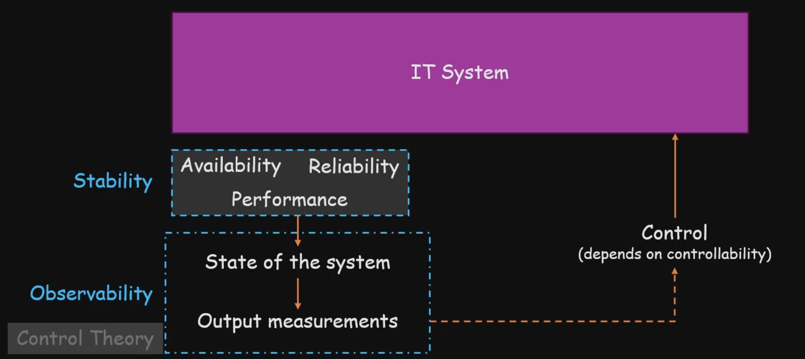

# Observability

- Observability is the process of taking `output measurements` (telemetry data) to understand the `internal state of the system`
- You can use the observability data to control the system and bring it to a stable state
  - The more `observable` a system is, the more `controllable` it is

- Observability helps identify the underlying cause, while `monitoring` does not
