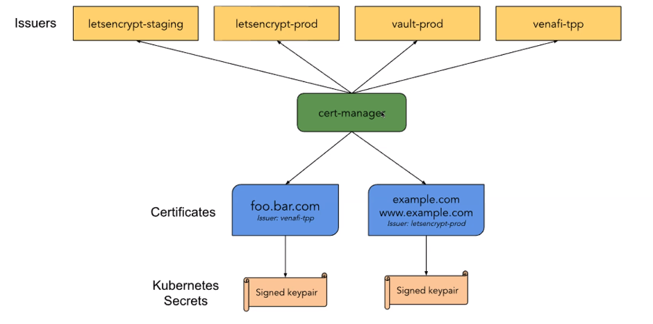

# cert-manager

- `cert-manager` is a certificate management controller
- Helps issuing certificates from a variety of sources (E.g., let's encrypt, hashicorp vault, venafi, a simple signing key-pair, self signed)
- Ensures certificates are valid and up to date. Attempts the renew certificates before it expires
- <https://cert-manager.io/docs/>
- <https://letsencrypt.org/how-it-works/>




```shell
# Install cert-manager controller
helm install "cert-manager" "jetstack/cert-manager" \
  --namespace "cert-manager" --create-namespace \
  --version v1.5.3 \
  --set installCRDs=true
```

## Issuers

- Issuers represent the Certificate Authority (CA)
- CAs generated signed certificates by honoring CSR
- `Issuer` is namespaced, while `ClusterIssuer` is global

```yaml
apiVersion: cert-manager.io/v1alpha2
kind: ClusterIssuer
metadata:
  name: letsencrypt
spec:
  acme:
    server: https://acme-v02.api.letsencrypt.org/directory
    email: mail@mail.com
    privateKeySecretRef:
      name: letsencrypt
    solvers:
      - http01:
          ingress:
            class: nginx
```

## Certificate

- A `x509 certificate` which will be kept up to date
- A certificate references a Issuer or ClusterIssuer
- `Certificate` resource is automatically created by cert-manager after it has been successfully signed by the CA

## Example

```yaml
apiVersion: networking.k8s.io/v1beta1
kind: Ingress
metadata:
  name: my-ing
  annotations:
    cert-manager.io/cluster-issuer: letsencrypt
spec:
  rules:
    - host: foo.hvitoi.com
      http:
        paths:
          - path: /
            pathType: Prefix
            backend:
              serviceName: foo-svc
              servicePort: 80
    - host: bar.hvitoi.com
      http:
        paths:
          - path: /
            pathType: Prefix
            backend:
              serviceName: bar-svc
              servicePort: 80
  tls:
    - hosts:
        - foo.hvitoi.com
      secretName: foo-secret
    - hosts:
        - bar.hvitoi.com
      secretName: bar-secret
    - hosts:
        - baz.hvitoi.com
```
