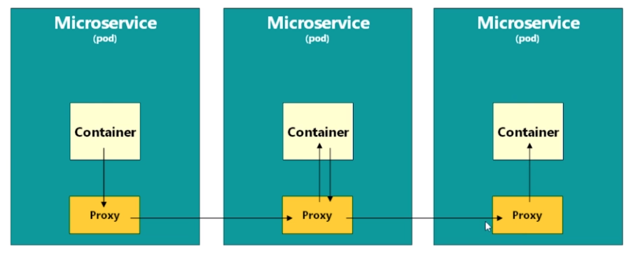

# Istio architecture

- Istio is a `Service Mesh`
  - A mesh refers to the network of interconnected service proxies (sidecars) and handle the communication between services
  - It's a layer of proxies (envoy, for example) that intercept, monitor, secure and control communication between those services
- It uses a proxy (`Envoy` Proxy) to intercept all the network traffic to services

## Challenges of Microservice Architecture (Without Istio)

- `Kubernetes`
  - The most successful framework for building distributed architectures
  - Orchestration framework
  - K8S alone is not good at the connection between the pods (with service concepts)
  - K8S alone doesn't give visibility of control over the connections

- For each microservice the following aspects must be incorporated
  - `Business Logic`
  - `Communication configurations`
  - `Security logic`
  - `Retry logic`
  - `Metrics & Tracing logic` (telemetry)

- This adds complexity to the services instead of keeping them simple and lightweight
- The solution? `Service Mesh`! A sidecar proxy keep all the non-business logic

## Istio Service Mesh

- A service mesh is a layer of software and sits underneath the pods
  - `Service Mesh` is the `network layer` that consists of the `Control plane` + `Proxies`
- All the networking is routed through the service mesh software
- Telemetry functions (Like Prometheus and Grafana). Tracing. Security. Traffic management
- A `Control Plane` automatically inject a `sidecar proxy` to each POD
  - The MS now talk to each other through those proxies

## Data plane

- `Data plane` is composed by intelligent `proxies` (envoy)
- Data plane is managed by the control plane
- `Envoy`, `sidecar`, `proxy` in Istio means the same!

- Istio creates a `proxy` container inside of each pod. The proxy would be a ClusterIP in convention k8s networking
- Proxies are collectively called the `Data Plane` in Istio
- Everything else is called `Control Plane`: telemetry, pilot, tracing, etc

- **sidecar mode**: an envoy proxy for each pod in the cluster
- **ambient mode**: uses a single per-node L4 proxy

## Control Plane

- The Control Plane manages and configures the proxies in the data plane
- The control plane is the `Istio Daemon` (istiod): Manage and inject envoy proxies
- As of istio v1.5, multiple components (Galley, citadel, pilot, mixer) were condensed into a single component `istiod`

  - **Galley**: Reads the k8s format and transform into the istio format
  - **Pilot**: Reads internal istio format and transform into envoy format (to be sent to proxies)
  - **Citadel**:Manage TLS certificates! Enable TLS/SSL across the entire cluster
  - **Mixer**: Implements policy checks (policy pod) and telemetry (telemetry pod)

- Istio `ingress gateway` and `egress gateway` are also part of the control plane

## Other components

- **Grafana**: Frontend interface for telemetry
- **Jaeger**: Tracing
- **Kiali**: Frontend interface for telemetry
- **Prometheus**: Scrape metrics to be presented in a good form
