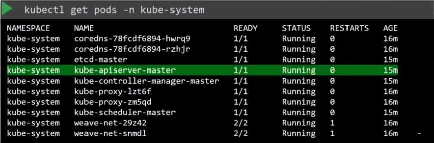

# Setup

## From scratch

- `kube-apiserver.service` must be configured manually if running a kubernetes cluster from scratch

```shell
# Download kube-apiserver binary
wget "https://storage.googleapis.com/kubernetes-release/release/v1.13.0/bin/linux/amd64/kube-apiserver"
```

```conf
ExecStart=/usr/local/bin/kube-apiserver \\
  --advertise-address=${INTERNAL_IP} \\
  --allow-priviledged=true \\
  --apiserver-count=3 \\
  --authorization-mode=Node,RBAC \\
  --bind-address=0.0.0.0 \\
  --enable-admission-plugins=Initializes,NamespaceLifecycle,NodeRestriction,LimitRanger,ServiceAccount,DefaultStorageClass,ResourceQuota \\
  --enable-swagger-ui=true \\
  --etcd-servers=https://127.0.0.1:2379 \\
  --event-tt=1h \\
  --experimental-encryption-provider-config=/var/lib/kubernetes/encryption-config.yaml \\
  --runtime-config=api/all \\
  --service-account-key-file=/var/lib/kubernetes/service-account.pem \\
  --service-cluster-ip-range=10.32.0.0/24 \\
  --service-node-port-range=30000-32767 \\
  --v=2
```

- The options can be viewed at `/etc/systemd/system/kube-apiserver.service`
- Or see the running options `px -aux | grep kube-apiserver`

## Via kubeadm

- `kubeadm` install the service automatically as a pod `kube-apiserver` inside of the `kube-system` namespace
- The pod is deployed on the master node



- The options can be viewed at `/etc/kubernetes/manifests/kube-apiserver.yaml`
