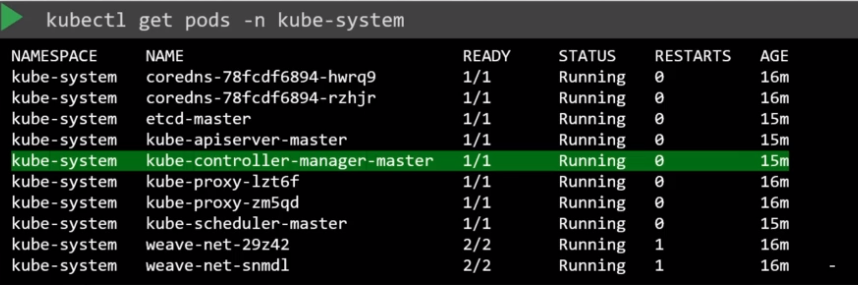

# Setup

## From scratch

- `kube-controller-manager.service` must be configured manually if running a kubernetes cluster from scratch

```shell
# Download kube-controller-manager binary
wget "https://storage.googleapis.com/kubernetes-release/release/v1.13.0/bin/linux/amd64/kube-controller-manager"
```

```conf
ExecStart=/usr/local/bin/kube-controller-manager \\
  --address=0.0.0.0 \\
  --cluster-cidr=10.200.0.0/16 \\
  --cluster-name=kubernetes \\
  --cluster-signing-cert-file=/var/lib/kubernetes/ca.pem \\
  --cluster-signing-key-file=/var/lib/kubernetes/ca-key.pem \\
  --kubeconfig=/var/lib/kubernetes/kube-controller-manager.kubeconfig \\
  --leader-elect=true \\
  --root-ca-file=/var/lib/kubernetes/ca.pem \\
  --service-account-private-key-file=/var/lib/kubernetes/service-account-key.pem \\
  --service-cluster-ip-range=10.32.0.0/24 \\
  --use-service-account-credentials=true \\
  --v=2 \\
  --node-monitor-period=5s \\
  --node-monitor-grace-period=40s \\
  --pod-eviction-timeout=5m0s \\
  --controllers=*
```

- The options can be viewed at `/etc/systemd/system/kube-controller-manager.service`
- Or see the running options `ps -aux | grep kube-controller-manager`

## Via kubeadm

- `kubeadm` install the service automatically as a pod `kube-controller-manager-master` inside of the `kube-system` namespace
- The pod is deployed on the master node



- The options can be viewed at `/etc/kubernetes/manifests/kube-controller-manager.yaml`
