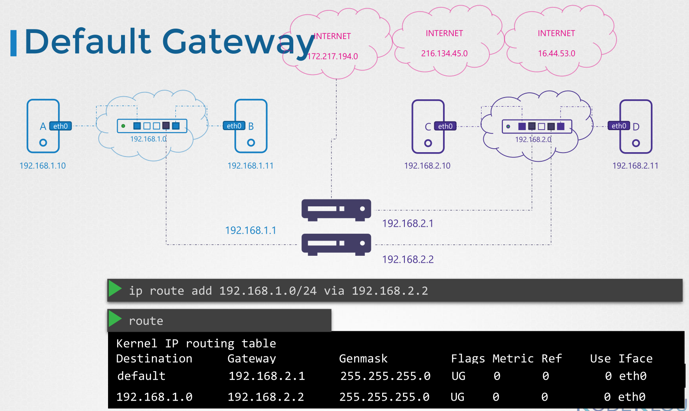
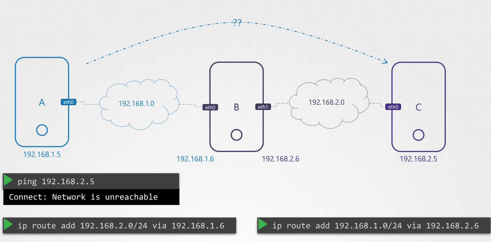
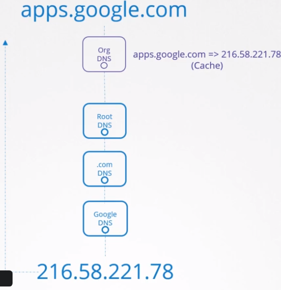
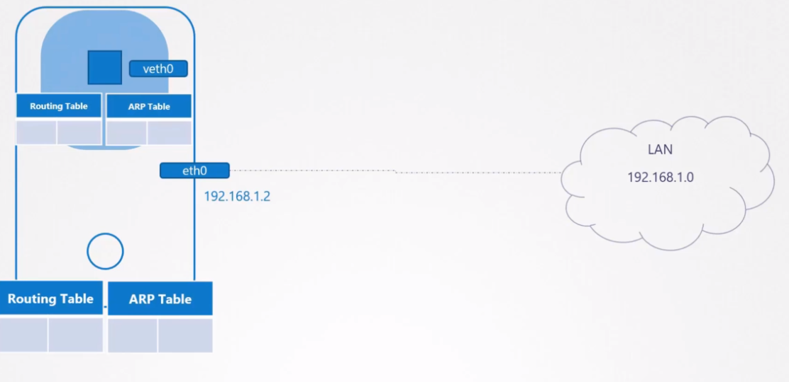
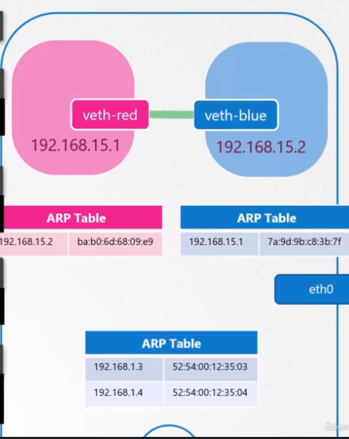
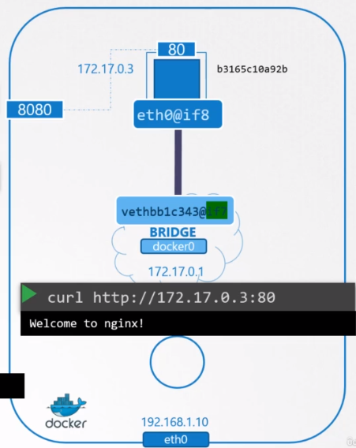

# Networking

## Network Devices

- `Switch`: connects devices in the same network
- `Router`: connects two or more networks. It gets one IP for each network it joins
- `Gateway` is a type of router, through which traffic passes from a network to another. A gateway must be specified in the routing table (`ip route add`)



## Package Forwarding

- By defaults on linux packages cannot be forwarded
- Package forwarding can be checked on `/proc/sys/net/ipv4/ip_forward`



## DNS (Domain Name System)

- `Name resolution`: translate hostnames to IP addresses
- Add dns entries locally to `/etc/hosts`
- A `DNS server` manages dns tables centrally. Then all hosts must look up that server.
- The host must configure the file `/etc/resolv.conf` with the dns server URL to fetch from

```conf
search mycompany.com prod.mycompany.com # append domain names to the requests
nameserver 192.168.1.100 # ip of a dns server
nameserver 8.8.8.8 # another dns server (google)
```

- `DNS Lookup Order`: 1st /etc/hosts, 2nd DNS server.
  - The order can be modified at `/etc/nsswitch.conf` (line with hosts entry)

## Domain Names & Levels

- `Root`: .
- `Top Level Domain` (TLD): .com, .net, .gov
- `Second Level Domain` (SLD): amazon.com, google.com
- `Sub Domain`: api.amazon.com. It is managed by the domain registrar


- Resolving steps
  1. Hit the local dns server
  1. Hit the root dns server
  1. Hit the .com dns server
  1. Hit the google dns server: serve you with the IP of the apps subdomain



## Record Types

- `A`: hostname to IPv4
  - webserver 192.168.1.1
- `AAAA`: hostname to IPv6
  - webserver 2804:14d:1:0:181:213:132:4
- `CNAME`: hostname to hostname (aliases)
  - food.web-server eat.web-server,hungry.web-server
- `NS`: name server. e.g., .com, .net

- Others: `CAA`, `DS`, `MX`, `NAPTR`, `PTR`, `SOA`, `TXT`, `SPF`, `SRV`

## Network namespaces

- It's an isolated network configuration applied only to a container
- This way a container has no network information about the host
- `ip netns add` to create network namespaces



### Virtual Ethernet Pair (VETH Pairs)

- Connectivity between namespaces is done via **virtual ethernet pair** (veth) or `virtual cable` (pipe)

1. Create Network Namespace
1. Create Bridge Network/Interface
1. Create VETH Pairs (Pipe, Virtual Cable)
1. Attach one side of VETH to Namespace
1. Attach othe side of VETH to Bridge
1. Assign IP Addresses
1. Bring the interfaces up
1. Enable NAT - IP Masquerade

```shell
ip netns add "red"
ip netns add "blue"

ip link add "veth-red" type veth peer name "veth-blue"
ip link set "veth-red" netns "red"
ip link set "veth-blue" netns "blue"

ip address add "192.168.15.1" dev "veth-red" -n "red"
ip address add "192.168.15.2" dev "veth-blue" -n "blue"

ip link set "veth-red" up -n "red"
ip link set "veth-blue" up -n "blue"

ip netns exec "red" ping "192.168.15.2"
ip netns exec "blue" ping "192.168.15.1"
```



### Linux Bridge

- It's an `interface` (of type bridge) for the host
- It's a `switch` for the namespaces
- This way, the `veth` connects to the bridge (not to the other pair anymore)

```shell
ip netns add "red"
ip netns add "blue"

ip link add "v-net-0" type "bridge" # creates bridge interface
ip link set dev "v-net-0" up

ip link add "veth-red" type "veth" peer name "veth-red-br" # creates 2 veth interfaces (one for the host and one for the namespace)
ip link add "veth-blue" type "veth" peer name "veth-blue-br"

ip link set "veth-red" netns "red"
ip link set "veth-red-br" master "v-net-0"
ip link set "veth-blue" netns "blue"
ip link set "veth-blue-br" master "v-net-0"

ip address add "192.168.15.1" dev "veth-red" -n "red"
ip address add "192.168.15.2" dev "veth-blue" -n "blue"

ip link set "veth-red" up -n "red"
ip link set "veth-blue" up -n "blue"

ip address add "192.168.15.5" dev "v-net-0" # assign an ip to the vnet in the host machine
```

### Bridge Network in docker


