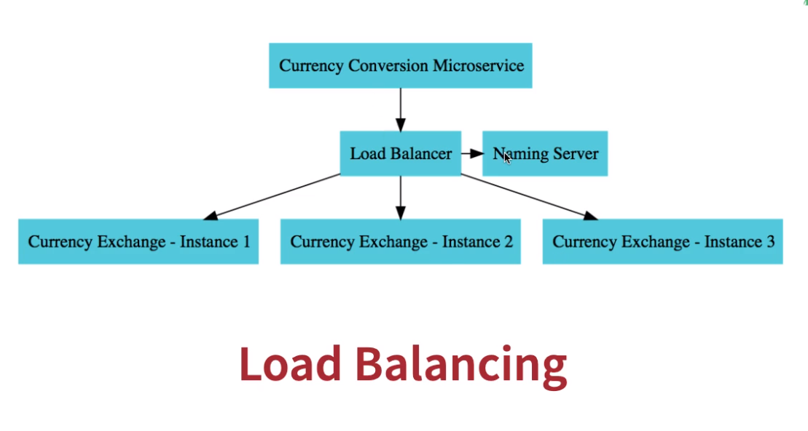

# Naming Server

- Netflix `Eureka` for naming server
- Allows load balacing

- `Eureka Server`: spring-cloud-starter-netflix-eureka-server
  - Scans all the services that have the eureka client library and register them
- `Eureka Client`: spring-cloud-starter-netflix-eureka-client
  - Uses a load balancing client under the hood
  - Talk to the eureka server and send req to the appropriate replica
