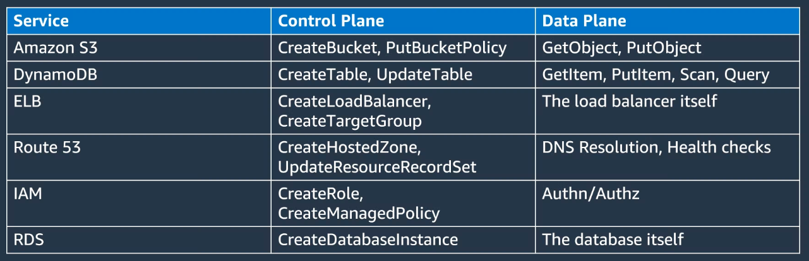

# Resilience

`Preventing`, `mitigating`, and `recovering` from failures

## Resilience Culture

### Service Ownership Model

> You build it, you run it (2 pizzas teams)

### Safe, Continuous Deployment

### Correction of Errors (COE)

- It's a process like a Postmortem that generates insights about the incident and generate action items to avoid the same issue again

### Operational Readiness Reviews (ORR)

- Ensure that whatever goes to production is ready to go to production
- A checklist that the application teams need to answer
- You need to clear out all the questions from the checklist
- Teams have access to a community of principals that could help to resolve the checklist
- GMUD? Change management process?

- Aspects
  - AZ Resilience
  - Region Independence
  - Customer Isolation
  - Dependency Resilience
  - Independent Start-up
  - Phased Deployment
  - Monitors and Alarms
  - Automated testing

## Control and Data Planes

- `Control Plane`
  - Create, update, delete, list, and describe resources
  - Complex orchestration with many dependencies
  - Lower volume
  - It's much more complex! Therefore it is going to fail more often

- `Data Plane`
  - The day-to-day business of the resource

- **Static Stability**: a system can operate in a static state and continue to operate as normal without the need to make changes during the failure or unavailable of a dependency
