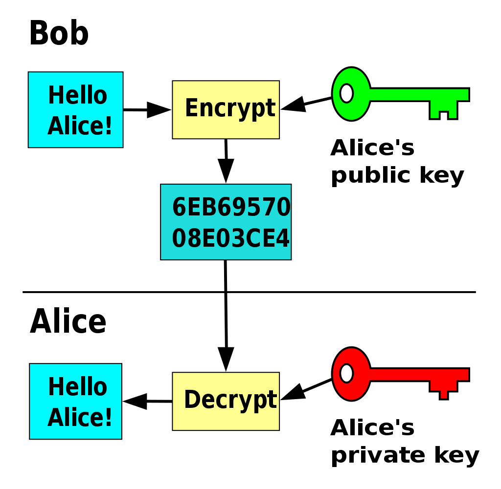

# Asymmetric encryption

- `Public Key`: used for encryption
- `Private Key`: used for decryption



- Both keys have the same length
- Asymmetric keys allow signing and verifying signatures

## Key Types

### RSA

- RSA (`Rivest-Shamir-Adleman`) algorithm
- Sizes
  - 1024 bits
  - 2048 bits (default)
  - 3072 bits
  - 4096 bits

```shell
ssh-keygen -t `rsa` # output both keys (private and public)
openssl genrsa # output private key only (public can be extracted from the private)
```
