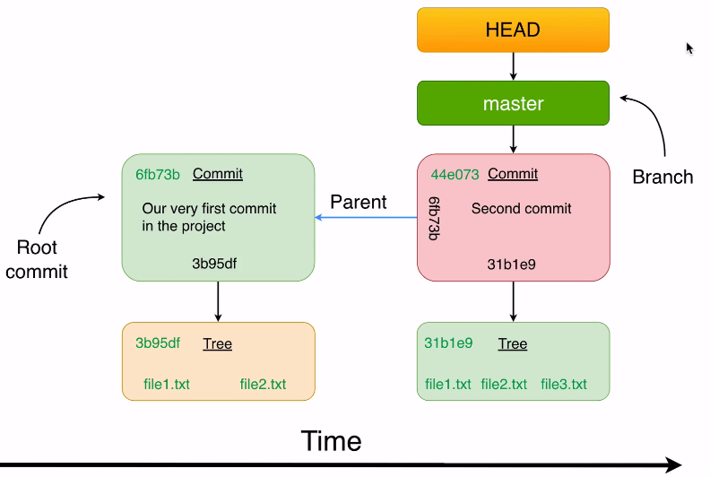
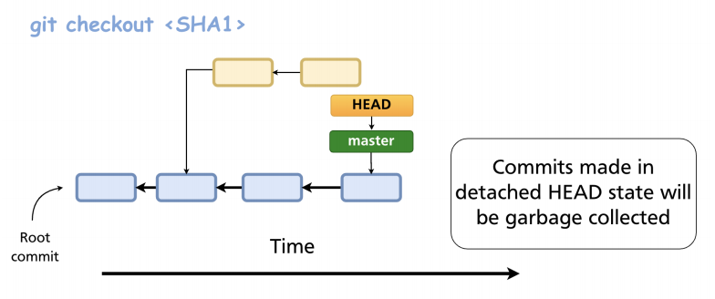

# HEAD

- `HEAD` is the pointer for the current branch/commit you are working on. There only exists ONE head
- Head is changed by running `git checkout`
- Head is stored at `.git/HEAD`. E.g.,

- Head on a branch

```txt
ref: refs/heads/master
```

- Head on a specific commit (`detached HEAD state`)

```txt
e2382f8e33a6d803fdc286bb14c15dd769f897a1
```



## Detached head state

- Checkout to a specific commit
- `Experimental commits` can be made in `detached head` and they will be garbage collected by git, because no other commits point to them (unreachable)
- New branches can be created from detached head state to retain those commits

```shell
git checkout `SHA1`
git commit -m "Changes in detached head"
git checkout -b new-branch # Branch created from the currently checked out branch
```


