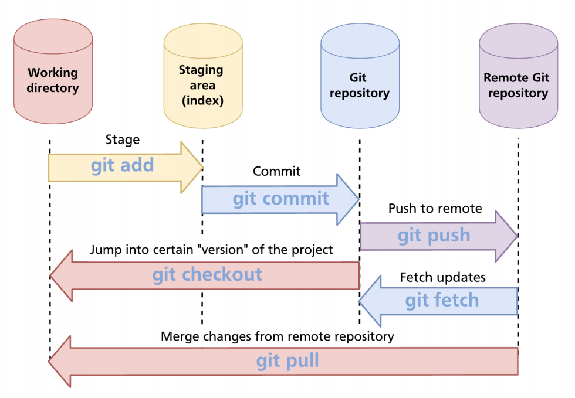
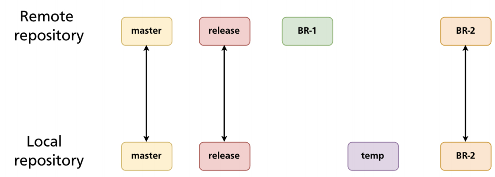

# Remote Repositories

- `Remote repository`: A centralized repository to store the latest stable code

## Tracking branch

- There is a deafult branch in the remote repo (default `master`/`main`). The default branch will always be tracked
- **Tracking branches** are branches which are synced between local and remote repos
  - After cloning from remote repo, git creates locally only the default branch!
  - Other branches can be tracked (`by simply checking out to the desired remote branch!`)
  - `Branch 'feature-1' set up to track remote branch 'feature-1' from 'origin'.`

