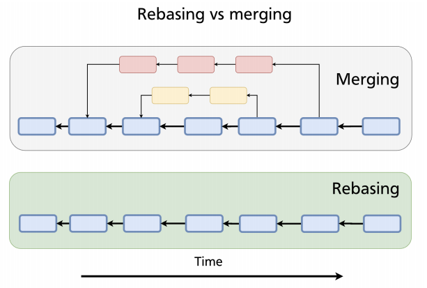
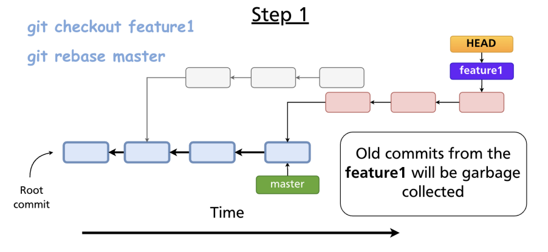
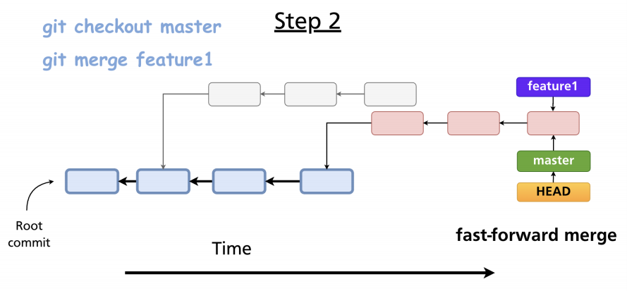

# rebase

- `Rebase` rewrites all the commits of a `feature branch` and makes it `linear`
- Modifies the timestamp
- Rebasing is a `destructive operation` that changes history
  1. Rebase the feature branch
  1. Merge feature branch into master
- Rebase is a way to `condense` all commits of a feature branch and the latest changes in master into `one commit` and merge it `fast-forward` to master
- When rebasing, all commits in feature branch are pointed to the last master commit



```shell
## Step 1: rebase
git checkout feature # checkout feature branch
git rebase master # rebase feature branch on top of base branch

## Step 2: Merge
git checkout master # checkout base branch
git merge feature # merge feature branch into base branch (FF will be used)
```

- `Step 1`

  

  - Git creates a copy of the feature commits at the end of the master branch (last commits)
  - The old feature commits will be garbage collected because there are no pointers to them

- `Step 2`

  

  - Merge with FF

## Rebase with squash

- All the commits are collapsed into `one commit` containing all the changes in the squashed commits
- Before squashing, the feature branch is also `rebased` so that `fast-forward` technique can be applied to merge into base branch
