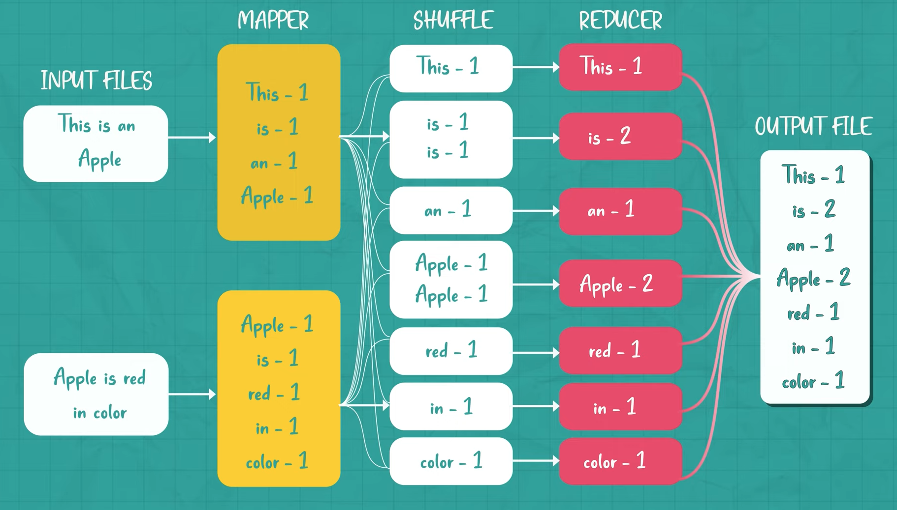

# MapReduce

- Divides the data for processing into partitions containing data
  - Data is **mapped** (transformed) with a `mapper function`
  - Data is **shuffled** automatically
    - The mapped data is categorized and associated with a machine, so that similar values are reduced together in the same machine
  - Data is **reduced** (aggregated) with a `reducer function`
- Distributes the `processing of data` (mapping, shuffling, reducing) across the hadoop cluster
- MapReduce is natively Java
- Streaming (stdin/stdout) allows interacing to other languages (ie Python)



## Map-Shuffle-Reduce Flow

> Raw Data

| user_ud | movie_id | rating | timestamp   |
| ------- | -------- | ------ | ----------- |
| 1       | 200      | 5      | 82163892713 |
| 2       | 100      | 1      | 82163892713 |
| 3       | 300      | 2      | 82163892713 |
| 2       | 200      | 4      | 82163892713 |
| 1       | 300      | 5      | 82163892713 |

> MapTask

```json
{
  "2": 100,
  "1": 200,
  "3": 300,
  "2": 200,
  "1": 300
}
```

> ShuffleTask

- Merge together values with a same key
- Sort by key

```json
{
  "1": [200, 300],
  "2": [100, 200],
  "3": [300]
}
```

> ReduceTask data

- Calculate the number of movies rated by a user

```json
{
  "1": 2,
  "2": 2,
  "3": 1
}
```

## Flow

1. Client Node talks to the `Resource Manager`
1. `Application Manager/Master` manages all the tasks happening on the `Worker Nodes`
1. Each Node can have multiple map/reduce tasks
1. Each Node will talk to the HDFS in order to fetch data to be processed
1. Each Node will try to fetch the closest possible data to avoid network bottlenecks

## Handling Failure

- It's resilient to failure
- The `Application Manager/Master` monitors `Worker Tasks` and restarts as needed
- The `Resource Manger` monitors `Application Master` and restarts as needed

## Caracteristics

1. `Distributed File System`
    - The input data is spread across multiple machines
    - Each chunk is processed independently
1. `No Data Movement`
    - The processing of each data is done local at where is file is stored
    - For that, the code (the map program) is sent to the machine (instead of pulling the data)
1. `Key-Val Structure`
    - The output of the map phase must result in a key-val pair so that the reduce phase can know which data to aggregate
1. `Machine Failures`
    - If a machine fails to process the map or reduce, it is simply reprocessed
    - The central controller will guarantee that the operations were done and retry accordingly
1. `Idempotent`
    - Mpa and reduce functions need to be idempotent to that it can be reprocessed on failures
