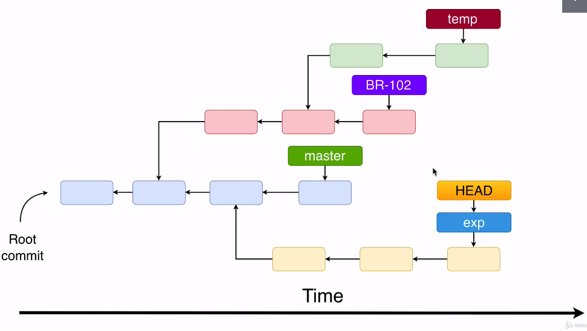

# Branches

- Branch is just a `text reference` to the commit
- The pointer (to a commit) for all branches are located in `.git/refs/heads`

## Branch merging

- Merge a secondary branch (`feature`) into the primary branch or receiving branch (`master`)
- A Pull Request (PR) must be made to ask the owner to merge the dev branch into the master
  - GitHub/Pull requests tab -> New pull request
  - Base (master) <- compare (dev)
- After a PR is created, all the future commits to dev branch will appear in the PR until it's closed
- `Close PR` finishes the PR with no merge
- `Merge PR` finishes the PR with merge to the master branch (all commits from dev are copied into master)
- When checking out to/from different branches the modifications are carried (moved) together! Until a commit is performed
