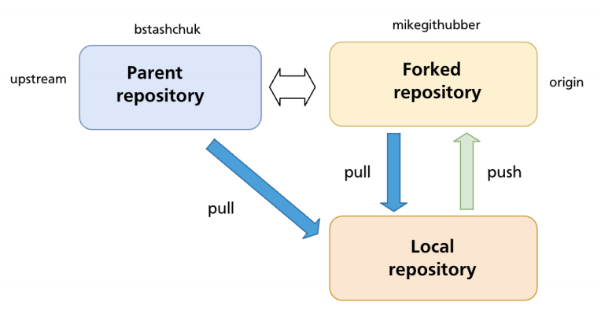

# Fork

- Fork is a github feature. For git, it's just a conventional repo.

## Sincronize changes from upstream

- `upstream` is the original repository, `origin` is forked from the upstream repo
- The `upstream remote` must be added to `git remote`

## Pull request to upstream

- A `PR must be opened` from the forked repository to the parent (upstream) repository
- Click `compare across forks` to select the base repository/branch send the PR
- The PR is then opened in the base repository
- After PR approval, the forked repo must pull the new changes from upstream
