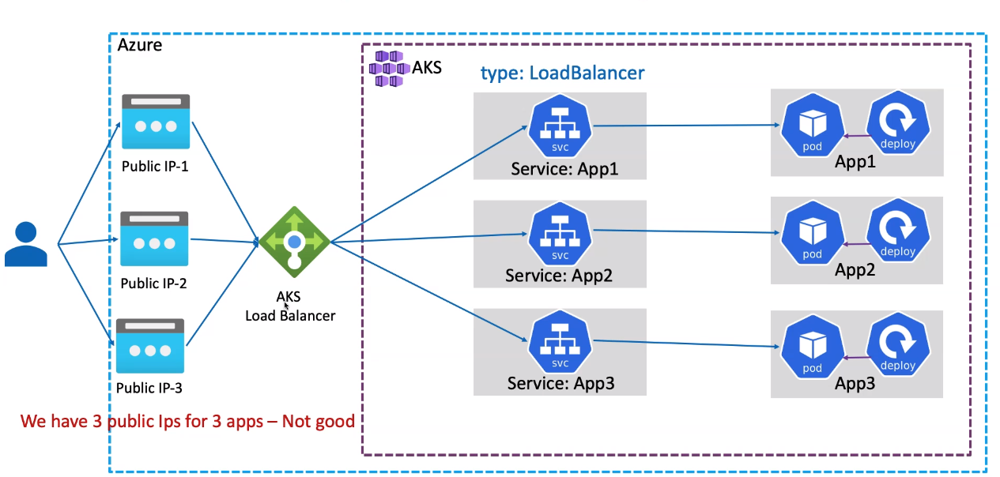

# Service (svc)

- Kubernetes services work as `layer 4 load-balancers`
- They provide a stable `DNS address`
- They forward the connections to one of the pods which are backing the service
- Services use `selectors` (just like deployments and replicasets) to match the target pods by label

## Properties

## spec.type

### ClusterIP

- Only accessible within the cluster
- Creates a `virtual IP` inside of the cluster to expose a pod or set of pods
- The reason for a virtual IP is that you cannot rely on the internal IP of the pod (it may change frequently)
- Also, provides a single interface for a group of pods

```yaml
apiVersion: v1
kind: Service
metadata:
  name: my-svc
spec:
  type: ClusterIP # Optional line. Services are ClusterIP by default
  selector:
    app: my-app
  ports:
    - name: my-cluster-ip
      protocol: TCP
      port: 3000
      targetPort: 3000 # it's also possible to define an alias here (that matches with the name defined at po.spec.containers[].ports[].name)
  clusterIP: None # None: Use the same IP of the pod. If not provided it will automatically set a random IP
```

### NodePort

- Expose the service on `each node`. This port is forwarded to the port on the `pod`
- With NodePort, even if the pod is hosted on only one node, the port is open for all the nodes
- The app is then accessible from all nodes (even if the app is not deployed in that specific node)
- The port range on the node is from `30000-32767`

- A random algorithm is used to forward request to multiple pods
- NodePorts span **across nodes**
  - Therefore reaching the IP-Port of any node forwards the traffic to the correct pod (even if it is not in that node)
  - <http://192.169.1.2:30008>, <http://192.169.1.3:30008>, <http://192.169.1.2:40008>

```yaml
apiVersion: v1
kind: Service
metadata:
  name: my-svc
spec:
  type: NodePort
  selector: # selects every pod with matching key-value pairs
    app: my-app
  ports:
    - name: my-node-port
      protocol: TCP
      port: 3050 # Service Port (the one that will be available for other apps inside the cluster)
      targetPort: 3000 # Container Port (port if not provided)
      nodePort: 31515 # Node Port (port to the outside world), random 30000-32767 port if not provided
```

### LoadBalancer

- Creates a cloud-provided LoadBalancer resource that will balance between the nodes of the cluster and route the traffic to the correct pod
- The LB can be accessed by its IP or a DNS A Record
- The end-user now reaches a LB (not the node directly as with NodePort)

- **LB Lifecycle**
  - When a `LoadBalancer` k8s manifest is created, a LB resource is automatically created in the cloud
  - The LB has as `target group` all the nodes (e.g., EC2 instances) in the cluster and it can be accessed by its DNS name A Record
  - When a `LoadBalancer` k8s manifest is deleted, the LB resource is automatically removed from the cloud

- **LB Drawbacks**
  - One `Public IP` (or DNS A Record) is created on the Cloud Provider for each Service in the Cluster
  - To overcome it, use ingress whenever possible
  - Also, there is no SSL termination (It's L4 LB, just redirect traffic)
  

#### AWS CLB

- DNS A Record: `0123456789abcdef0123456789abcdef-123456789.us-east-1.elb.amazonaws.com`

```yaml
apiVersion: v1
kind: Service
metadata:
  name: my-lb
spec:
  type: LoadBalancer # CLB L4
  selector:
    app: my-app
  ports:
    - protocol: TCP
      port: 80
```

#### AWS NLB

- DNS A Record: `0123456789abcdef0123456789abcdef-0123456789abcdef.elb.us-east-1.amazonaws.com`

```yaml
apiVersion: v1
kind: Service
metadata:
  name: my-lb
  annotations:
    service.beta.kubernetes.io/aws-load-balancer-type: nlb
spec:
  type: LoadBalancer
  selector:
    app: my-app
  ports:
    - protocol: TCP
      port: 80
```

### ExternalName

- Proxies the connection to an external URL
- Uses the default port for the service
- A common use-case for `ExternalName` is for database connections with cloud providers

```yaml
apiVersion: v1
kind: Service
metadata:
  name: mysql
spec:
  type: ExternalName
  externalName: mydb.mysql.database.azure.com
  externalName: mydb.abcdefghijkl.us-east-1.amazonaws.c0om
```
