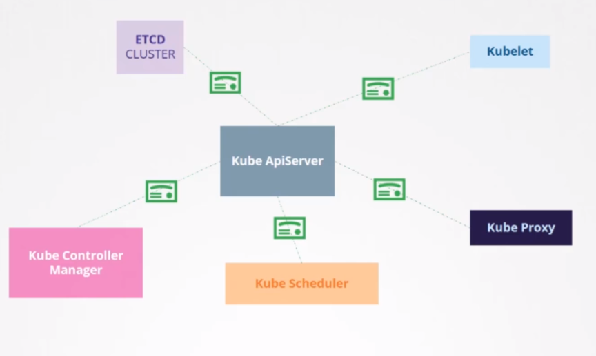
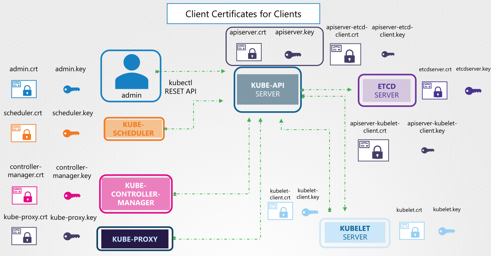
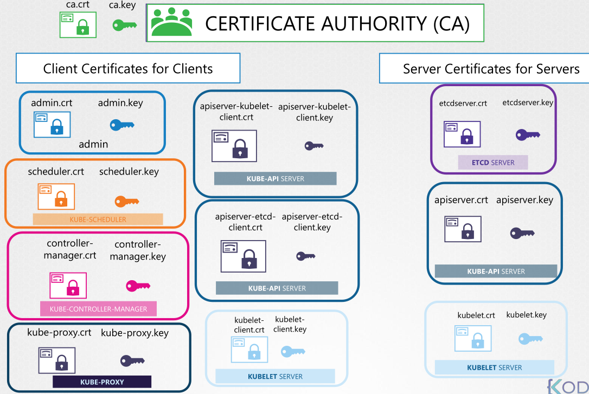
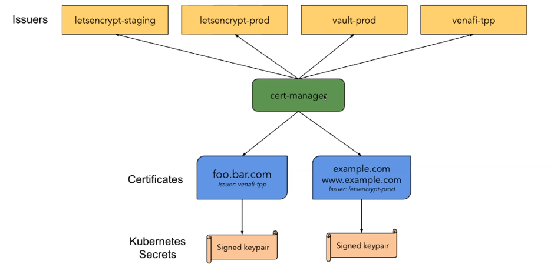
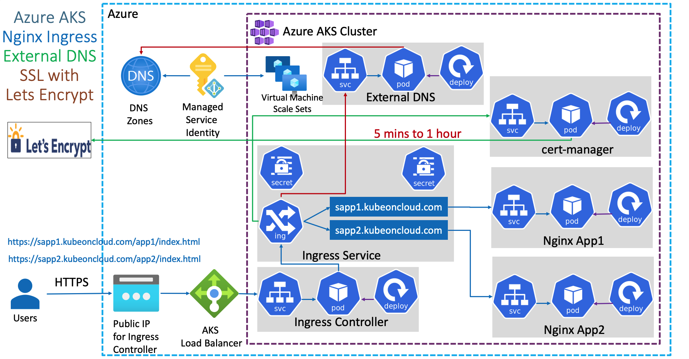

# Certificates

- All the communication between the kubernetes components are TLS `encrypted`



- For encryption, certificates are necessary




## Certificate Properties

- `CN`: Common Name. Name of the component. E.g., system:node:node01
- `O`: Organization. Specify the group. E.g, SYSTEM:NODES

## Certificate Path

- Path for manual installation: `/var/lib/kubernetes/`
- Path for kubeadm installation: `/etc/kubernetes/pki/`

## Certificate API

- The `Certificate Authority (CA)` and the `CA Server` is in the `master nodes`
- The CA private keys are stored in the master nodes
- The CA in kubernetes has the `Common Name (CN)` `kubernetes`

- `The Certificate API` is useful to avoid manually ssh into the master node to sign a certificate
- With the certificate API, the CSR is created as a `CertificateSigningRequest` resource and can be reviewed and approved via kubectl
- All the certificate operations are carried out by the `Controller Manager`
  - It has the `CSR-APPROVING` and `CSR-SIGNING`controllers

```shell
# generate private key
openssl genrsa -out "henry.key" "2048"

# create csr
openssl req \
  -new \
  -key "henry.key" \
  -subj "/CN=henry" \
  -out "henry.csr"

# encode csr
cat "henry.csr" | base64
```

```yaml
apiVersion: certificates.k8s.io/v1beta1
kind: CertificateSigningRequest
metadata:
  name: henry
spec:
  groups:
    - system:authenticated
  usages:
    - digital signature
    - key encipherment
    - server auth
  request: LS0tLkasRIJDHKAHK81LS0tLkasRIJDHKAHK81...
```

```shell
kubectl get csr
kubectl certificate approve "henry"
```

- After approval, the CSR resource will have a new "certificate" field which can then be shared with the user

## cert-manager

- `cert-manager` is a native Kubernetes certificate management controller
- Helps issuing certificates from a variety of sources (E.g., let's encrypt, hashicorp vault, venafi, a simple signing key-pair, self signed)
- Ensures certificates are valid and up to date. Attempts the renew certificates before it expires
- <https://cert-manager.io/docs/>
- <https://letsencrypt.org/how-it-works/>




- Install cert-manager controller

```shell
helm install "cert-manager" "jetstack/cert-manager" \
  --namespace "cert-manager" --create-namespace \
  --version v1.5.3 \
  --set installCRDs=true
```

### Issuers

- Issuers represent the Certificate Authority (CA)
- CAs generated signed certificates by honoring CSR
- `Issuer` is namespaced, while `ClusterIssuer` is global

```yaml
apiVersion: cert-manager.io/v1alpha2
kind: ClusterIssuer
metadata:
  name: letsencrypt
spec:
  acme:
    server: https://acme-v02.api.letsencrypt.org/directory
    email: mail@mail.com
    privateKeySecretRef:
      name: letsencrypt
    solvers:
      - http01:
          ingress:
            class: nginx
```

### Certificate

- A `x509 certificate` which will be kept up to date
- A certificate references a Issuer or ClusterIssuer
- `Certificate` resource is automatically created by cert-manager after it has been successfully signed by the CA
