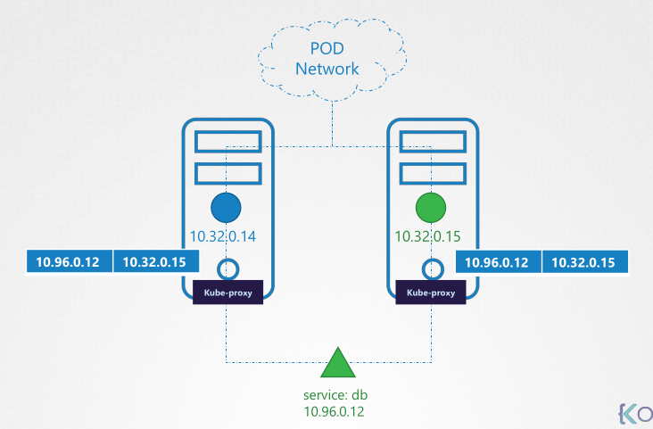

# kube-proxy

- It's a `network proxy` that maintains `network rules` on nodes
- These network rules allow network communication between the pods (from inside or outside of the cluster)
- It looks for new `services` and create rules on each node to forward traffic to these services to the backend pods
- Kube proxy is deployed as `DaemonSet` (one replica for each node)

## IP tables

- Kube-proxy creates an `IP table` rule on each node to forward traffic
  - IP of the service -> IP of the pod

