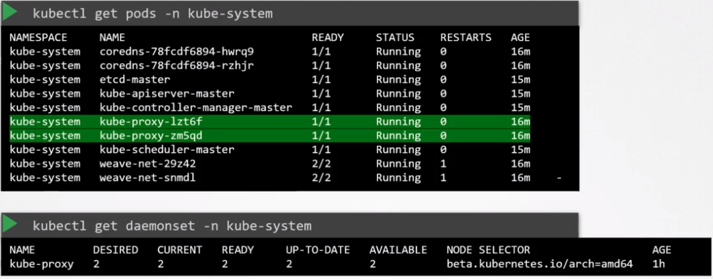

# Setup

## From scratch

- `kube-proxy.service` must be configured

```shell
# Download kube-proxy binary
wget "https://storage.googleapis.com/kubernetes-release/release/v1.13.0/bin/linux/amd64/kube-proxy"
```

```conf
ExecStart=/usr/local/bin/kube-proxy \\
  --config=/var/lib/kube-proxy/kube-proxy-config.yaml
Restart=on-failure
RestartSec=5
```

- The options can be viewed at `/etc/systemd/system/kube-proxy.service`
- Or see the running options `px -aux | grep kube-proxy`

## Via kubeadm

- `kubeadm` install the service automatically as a pod `kube-proxy` inside of the `kube-system` namespace
- In fact it is a `daemonset`
- The pod is deployed for each worker node



- The options can be viewed at `/etc/kubernetes/manifests/kube-proxy.yaml`
