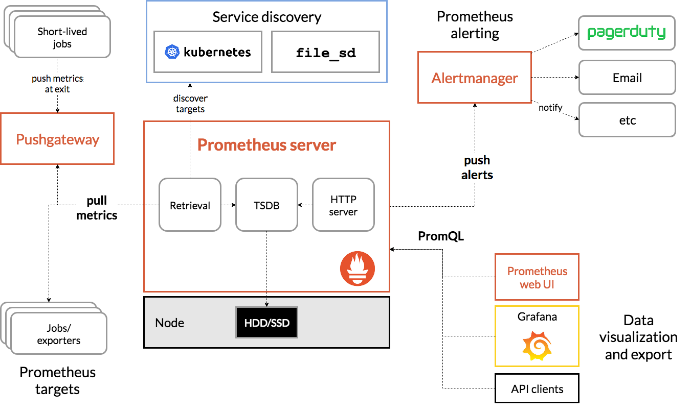

# Prometheus

- It's created to monitor highly dynamic container environments
- Constantly `monitor` all the service and `alerts` when it crashes

## Components

- **Retrieval**
  - Worker that pulls the metrics data
  - Pulls from HTTP endpoints
  - Default endpoint for the service: `{host}/metrics`
  - The target must `expose` this /metrics route
  - The metrics must be exposed in the correct format
  - For services that do not expose /metrics by default it needs an `exporter` (to format and expose the metrics)
  - For `short-lived jobs` the application push then into a `pushgateway` and prometheus scrapes from the pushgateway
- **Storage**
  - Time series DB to store metrics data
  - Stores the data in Disk
  - Can also integrate with `Remote Storage Systems`
- **HTTP server**
  - Accept `PromSQL` queries to consult the storage
  - Prometheus exposes its own `/metrics` endpoint
