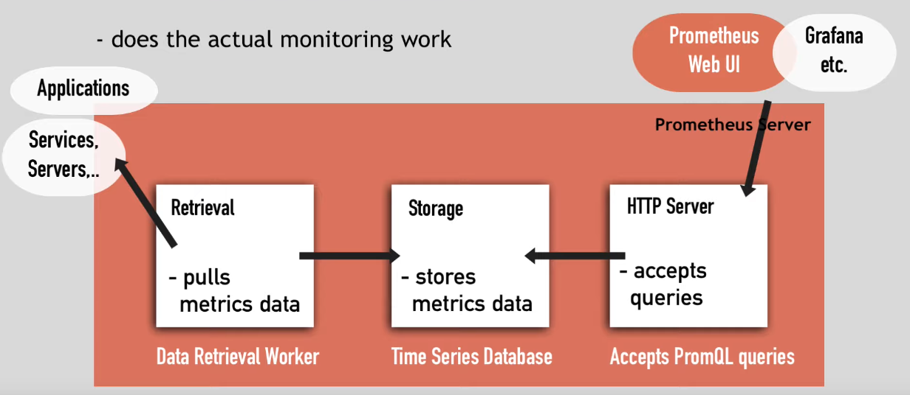

# Prometheus

- It's created to monitor highly dynamic container environments
- Constantly `monitor` all the service and `alerts` when it crashes

## Components

- **Retrieval**
  - Worker that pulls the metrics data
  - Pulls from HTTP endpoints
  - Default endpoint for the service: `{host}/metrics`
  - The target must `expose` this /metrics route
  - The metrics must be exposed in the correct format
  - For services that do not expose /metrics by default it needs an `exporter` (to format and expose the metrics)
  - For `short-lived jobs` the application push then into a `pushgateway` and prometheus scrapes from the pushgateway
- **Storage**
  - Time series DB to store metrics data
  - Stores the data in Disk
  - Can also integrate with `Remote Storage Systems`
- **HTTP server**
  - Accept `PromSQL` queries to consult the storage
  - Prometheus exposes its own `/metrics` endpoint



## Targets and Metrics

- Prometheus monitors the `targets`
  - Linux/Windows Server, Single Application, Apache Server, Databases, etc
- Each target has `units`, which expose the `metrics`
  - CPU, memory/disk usage, exception counts, requests count, request duration, etc
- Each metric has `type` and `help` attributes
  - `Help`: description of what the metrics is
  - `Type`: there are three types
    - _Counter_: How many times happened
    - _Gauge_: The current value now
    - _Histogram_: how long or how big

## Prometheus configuration

- `prometheus.yml`: defines which targets at which interval
- Usually you won't go create the prometheus configuration, but use the prometheus CRDs created by the `prometheus operator` to deploy the configuration
- The prometheus operator is a manager of all prometheus components

```yaml
global:
  scrape_interval: 15s
  evaluation_interval: 15s # how often to evaluate the rules
rule_files: # aggregating metrics and create alerts
  - "first.rules"
  - "second.rules"
scrape_configs: # what resources prometheus monitors
  - job_name: prometheus # scrape prometheus own metrics
    static_configs:
      - targets: ["localhost:9090"]
  - job_name: node_exporter
    scrape_interval: 1m
    scrape_timeout: 1m
    static_configs:
      - targets: ["localhost:9100"]
```

## Alert Manager

- Prometheus component that triggers alerts
- Reads alert rules of config file and `push alerts` if the condition is met
- Email, Slack, etc
