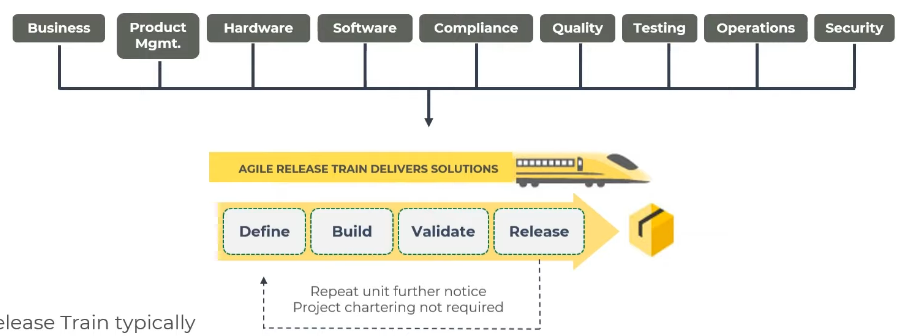
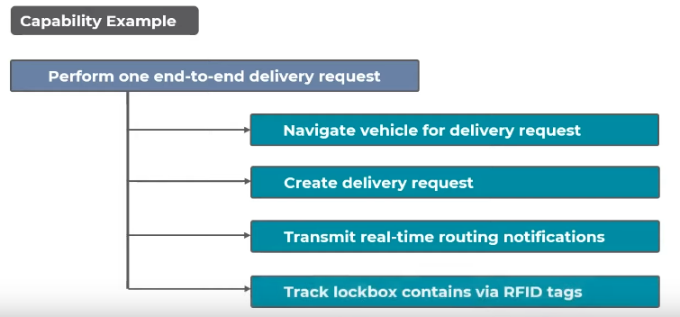
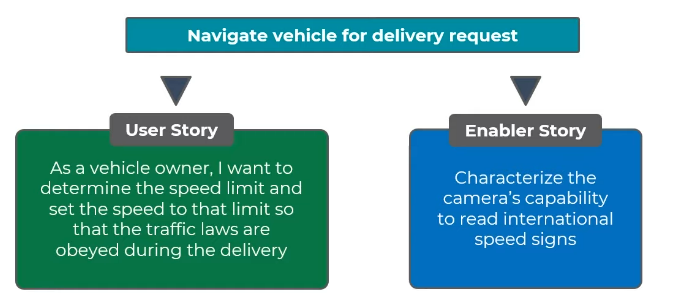
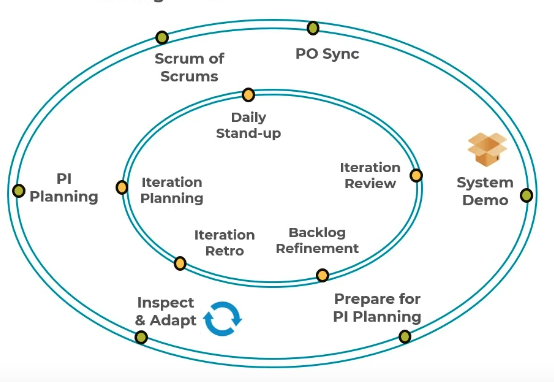

# Agile Release Train (ART)

- Refers to the group of all `agile teams`
- They plan, commit, develop and deploy solutions
- Total number of people in the whole ART: `50 - 125 people`
- Total number of teams in the whole ART: `5 - 12 teams`

- Members of ART must be `cross-functional`. Must contain several areas of knowledge

## ART Roles

- `Release Train Engineer` (RTE)
  - Leader and coach for the ART
  - Facilitate program execution
  - Assist teams
  - Communicate with stakeholders
  - Manage risk
  - Relentless continuous improvement
- `Product Management`
  - Building of a product
  - Vision, roadmap, new features
  - Identify customer needs (user centricity)
  - Design thinking
- `System Architecture/Engineering`
  - Define the architecture of the system
  - Make sure system is developed as intended
  - Analyze technical tradeoffs
- `Business Owners` (Executive)
  - Key stakeholders of the ART
  - Responsibility over the business outcomes
- `Customers`
  - Buyers of the value and the solutions created
- `System team`
  - Assist in building and maintaining development, integration and testing (e2e)
- `Shared Services`
  - Specialists. E.g., data security, DBAs, etc
  - Cannot be dedicated to a specific train

## ART Artifacts

- 4-tier hierarchy of artifacts

- **Feature**
  - Chunk of functionality that delivers business value
  - It must fit in a PI
  - Belongs to a single ART
- **Story**
  - Short description of a functionality from the perspective of the end user
  - It's divided into
    - `user story`:functionalities
    - `enabler story`: _exploration_, _architecture_, _infrastructure_, _compliance_
  - As a _(user role)_, I want to _(activity)_, so that _(business value)_
  - `INVEST` story: Independent. Negotiable. Valuable, Estimable, Small, Testable
  - `CCC`: Cart (write on the cart the problem), Conversation (details as discussed), Confirmation (acceptance criteria)
- **Task**
  - Further detail of stories (optional)

## ART Events

- **Program Increment (PI)** is the timebox during which an ART `delivers value` in the form of tested working software
- Consist of `8 - 12 weeks` period
  - **4 Development** iterations
  - **1 Innovation & Planning** iteration
- It's `cadence-based` (all ARTs share the same date)

### PI Planning

- Everyone must participate
- 2 days long

- `Facilitation` (RTE)
- `Business context` and `vision` (PM)
- `Architectural guidance` (System Architect)

- The outcome of this meeting is

  - **PI objectives**
    - What can be delivered (prioritization)
    - Priority level (1 to 10)
    - `business value` (BV), `action value` (AV) or `uncommitted objective`
    - `SMART`: specific, measurable, achievable, realistic, time-bound
  - **Program board**
    - Visualize dependencies between the teams
    - Features (blue)
    - Milestone/event/demo (orange)

- **Day 1**

  - `Business context`: presentation by the execution
  - `Product/Solution Vision`: presentation by the product manager
  - `Architecture Vision and development practices`: Architecture, common frameworks, etc. Agile tooling, engineering practices. Presentation by the architect.
  - `Planning context and lunch`: Facilitator explains the planning process
  - `Team breakouts`: identify risks and impediments. Architect and Product Manager
  - `Draft plan review`
  - `Management review and problem solving`

- **Day 2**

  - `Planning Adjustments`
  - `Team breakouts`
  - `Final plan review and lunch`
  - `Program risks`: How to deal with the risks: ROAMed (resolved, owned, accepted, mitigated)
  - `PI confidence vote`: team and program confidence vote
  - `Plan rework if necessary`: planning continues until commitment is achieved
  - `Planning retrospective and moving forward`

### Scrum of Scrums

- Scrums + RTE
- Visibility of `progress`, `impediments` and `dependencies` on other teams
- 30-60min timebox + meetafter if necessary
- If this event is combined with PO sync, it's called `ART sync`

### Product Owner Sync

- POs + RTE or PM
- 30-60min timebox
- Visibility of how well ART is progressing towards the PI objectives
- If this event is combined with scrum of scrums, it's called `ART sync`

### System Demo

- Occurs after the completion of every iteration in all teams
- Conducted by the Product Manager (PM)
- Integrated view of the new features delivered by the ART
- Provide the stakeholders a measure of progress within the PI
- Made for the Business Owners

### Prepare for PI Planning

- Prepare for PI Planning

### Inspect & Adapt

- Happens of the end of each PI
- Reflect, problem solve, and identify improvement actions
- The current state of the solution is demonstrated and evaluated by the ART
- Results in a set of `improved backlog` items that go to the `Program Backlog` for the next PI planning

- `Quantitative and qualitative measurement`
- `Problem-Solving Workshop`: apply root-cause analysis, identify the biggest one using pareto
