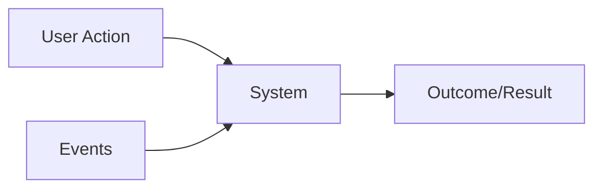

# Functional Requirements

- Also know as **Feature Set**
- Specify `what the system should do`. They describe system behavior, features, and interactions.
- Functional requirements DO NOT influence on the architecture, since a feature can be implemented using any kind of architecture (just it may not be viable)

## Examples

1. User must `authenticate` to access the platform
2. user can access the platform via mobile or web app
3. User must be able to `search` an item
4. User can `upload` a file
5. User can generate a link so that he can `share` the file with other users
6. Other users can download the file from the link
7. User can see a report of what other users have downloaded his file
