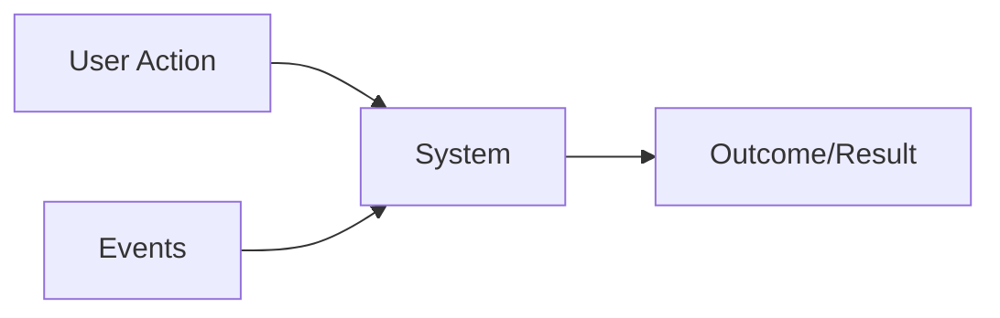

# Functional Requirements

- Also know as **Feature Set**
- Specify `what the system should do`. They describe system behavior, features, and interactions.

- Requirements that define the target feature
- Results may be triggered by either user actions or events
- Functional requirements DO NOT influence on the architecture, since a feature can be implemented using any kind of architecture (just it may not be viable)

## Examples

- User must have access to the e-commerce platform
- User must be able to search an item
- After a user uploads a file, they will get a unique link that they can share with other users. Any user with that link can download the file.

