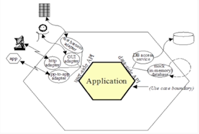
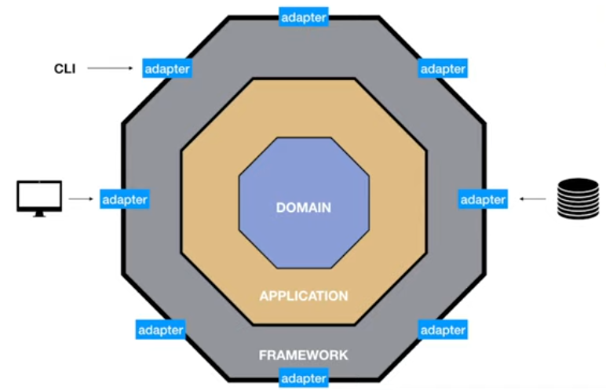
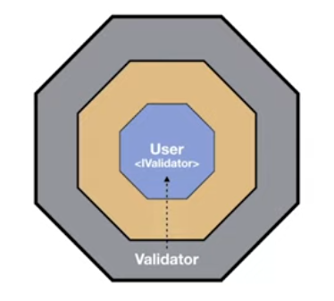
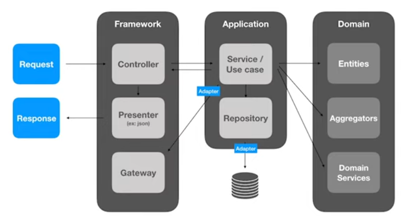
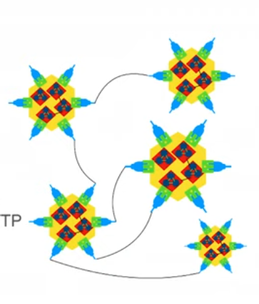

# Hexagonal Architecture

- The hexagon does not necessary has to contain 6 sides!: The sides in the hexagon is supposed to represent a port

## Influences

- `Dr. Ivar Jacobson`

  - Created UML and RUP
  - Created EIC (Entity-Interface-Control) -> ECB (Entity-Control-Boundary) in 1992

- `Dr. Alistair Cockburn`

  - Signed the Agile Manifesto
  - Created the Hexagonal Architecture (Ports and Adapters) in 2005

- `Jeffrey Palermo`

  - Microsoft MVP
  - Created Onion Architecture (2008) - very similar to Hexagonal!

- `Robert C. Martin` (Uncle Bob)

  - Signed the Agile Manifesto
  - Created SOLID (2000)
  - Created Clean Code (2009)
  - Created Clean Architecture (2017)
    - Entity: core and business rules
    - Use cases: flow for treating the business rules

## Parts

- **Domain**
  - It's the meaning of the software: the reason for it to exist
  - `Business rules` and `entities`!
  - DDD helps modelling the domain
- **Application**
  - Contain the `Use cases`
  - The order to apply the business rules: the `flow`
  - Example: create the user, send email, confirm the email
- **Framework**
  - Libraries that help the application to give a response to the request
  - It doesn't know what the application is about, it just facilities the delivering of requests
  - E.g., serialization, http, visualization

## Flow of information

- The flow of information is always into the system
- Framework -> Application -> Domain (and never backwards)
- To implement it, use the `D` from SOLID: Dependency Inversion Principle
  - Dependend of `abstractions`! Stable Interfaces! Not implementations
  - Dependency injection to import classes (e.g., from the Framework to the Domain) via an Interface

## Tests

- `Domain`
  - Unit tests
- `Application`
  - Integration tests
  - Uses real domains
  - Uses mocks for external dependencies
- `Framework`
  - Tests with the external world.
  - E.g., API REST requests, CLI requests, etc

## Diplomat Architecture

- `Diplomat Architecture`: Ports & Adapters for Functional Architecture

- **Ports**
  - Communication complexity: HTTP, gRPC, Kafka, etc
- **Adapters**
  - Wire the port to the generic controllers
- **Controllers**
  - Wire the generic request to the handler functions
- **Pure Functions**
  - The business logic
  - Use standard libraries. Keep it simple!

