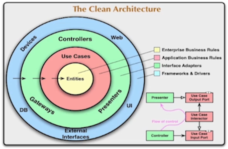

# Clean Architecture

- Created by Robert Martin (Uncle Bob)
- Similar to onion and hexagonal
- `Domain` (real) must be decoupled from `Infrastructure` (code)
  - The code must be the most similar to the real world




- `Domain`: business rules
- `Application`: use cases
- `Infrastructure`: web server, database

## Characteristics

- Isolate code from application domain
- `Dependency Inversion` Principle (DIP)
  - the rules interact with the domain
  - use of interfaces
- `Object Oriented` Programming (OOP)
- `Testability`: 100% coverage on domain layer
- Independent of frameworks and infrastructure details

## Definitions

- `Entity`: classes that have an unique id. E.g. person with cpf
- `Value Object`: If 2 objects have the same attribute values, they are the same. E.g., email

```javascript
const p1 = { x: 2, y: 3 };
const p2 = { x: 2, y: 3 };
assert(p1 !== p2); // NOT what I want
```

- `Factory`: A class that builds other objects. It must have a `.build()` methods that returns the newly created object
- `Repository`: Represents a source of data
- `Service`: Represents a class that executes some action that does not belong to an entity
- `Use Case`: Use Cases, Application Service or Command Handler are entrypoints for the application independent of the interface (web, cli, etc)
- `Repository`
  - Source of data `interface` between application and infrastructure layers
  - The domain contains the interface, the infrastructure contains the implementation
  - `Dependency Inversion` by means of interfaces
