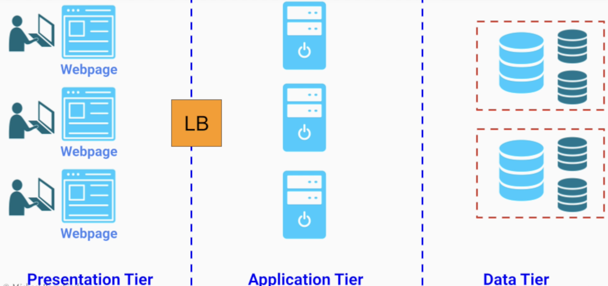
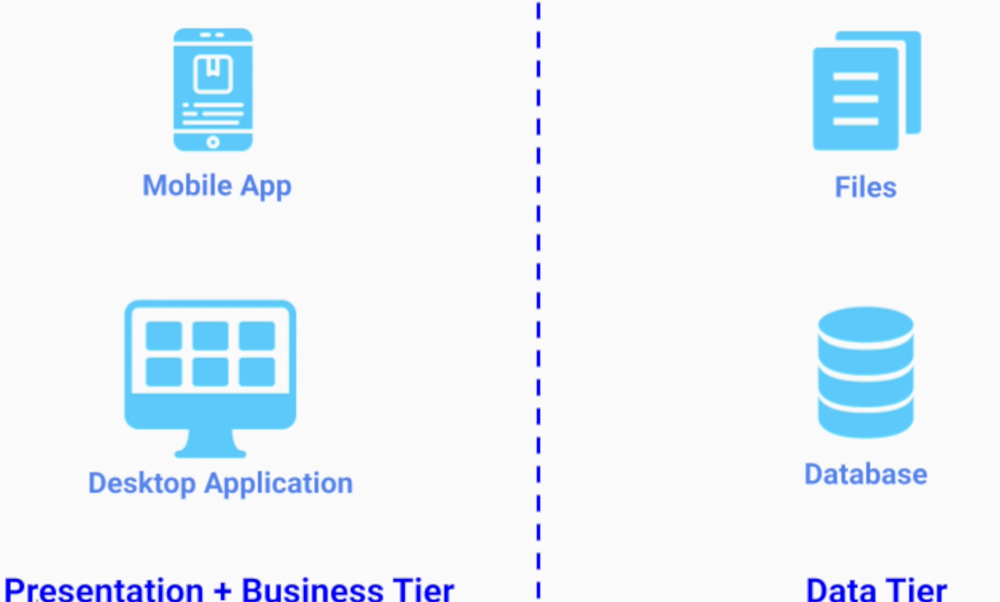
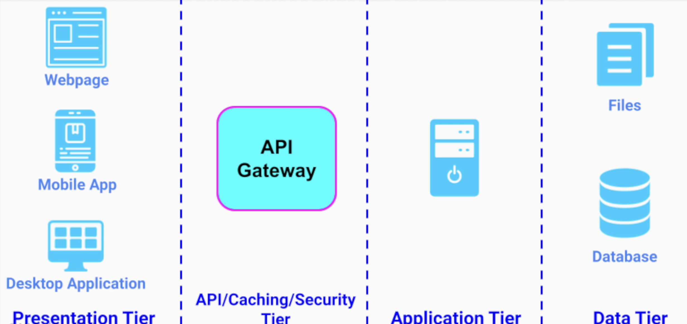

# Multi-Tier Architecture

- The service is broken down into multiple independent (logically and physically) tiers
- Each tier communicates only with the tier above it

## Three-Tier

- One of the most common architecture patterns for web-based systems
- Tiers
  1. `Presentation Tier`
  1. `Application Tier`
  1. `Data Tier`

- One flaw is the `monolithic structure` of the logic tier, which starts becoming too chaotic for large systems

### Presentation Tier

- Presentation Tier
  - User Interface

- This tier should not contain any business logic
  - The user can change this code!

- `Responsibilities`
  - Display information to the user
  - Take the user's input

- `Examples`
  - A webpage
  - A mobile app
  - A desktop application

### Application Tier

- Application Tier
  - Business Tier
  - Logic Tier

- `Responsibilities`
  - Provide all the functionalities and features
  - Process data from the presentation tier
  - Apply business logic to it

- `Examples`
  - Services

### Data Tier

- `Responsibilities`
  - Store and persistence of user and business-specific data

- `Examples`:
  - Files in the filesystem
  - Database

## Two-Tier

- Presentation + Application together
- It's common on simple apps. E.g., notes app

## Four-Tier

- An additional layer of security between the presentation and the application

