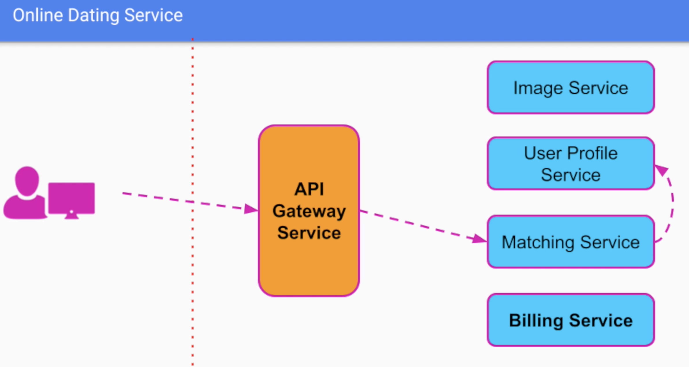
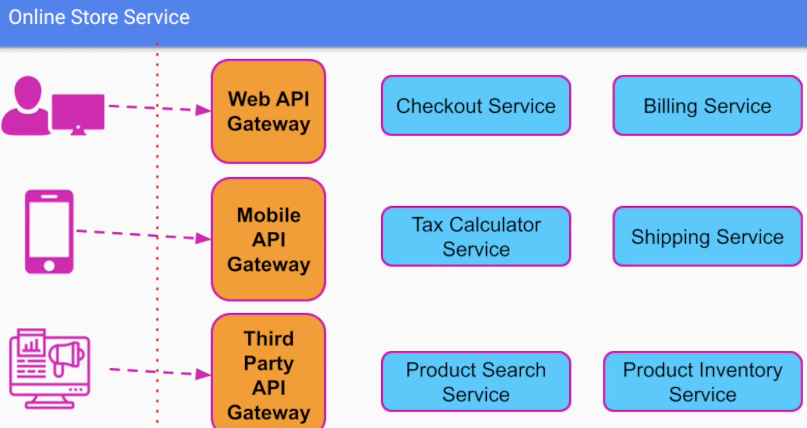

# Microservices

> Microservices architecture organizes our business logic as a collection of loosely coupled and independently deployed services
> Each service is owned by a small team and has a narrow scope of responsibility

- Watch out with `distributed monolith`, where the microservices are so tightly coupled that they offered the disadvantages of both worlds

## Benefits of microservices

1. Smaller codebase
    - Development becomes easier
    - Building and testing becomes easier
1. Better performance
    - Lower CPU usage
1. Horizontal Scalability
    - Easier to scale just one part of the system
1. Organizational Scalability
    - Independent deployability
    - Team autonomy (technology, frameworks, release schedule, etc)
1. Fault Isolation
    - Limit the "blast radius" of failure

## Monolith as default option

- Microservices shouldn't be the default option
- Monolith is usually more adequate for smaller teams
- If you think a service architecture could help, try it with one of the modules from a very simple monolith typology and let it evolve from there.

> Industry tends to focus on tech instead of the outcome. One should use microservices as a means to obtain a desired outcome rather than for the sake of using a new technology

## Best Practices

- **Single Responsibility Principle**
  - Each service needs to be responsible for only one
    - Business capability
    - Domain
    - Resource
    - Action

- **Separate Database Per Service**
  - Otherwise every schema change would require careful coordinations between teams
  - Data has to be split in a way that each service can be almost completely independent
  - Data duplication is an expected overhead

## Examples

