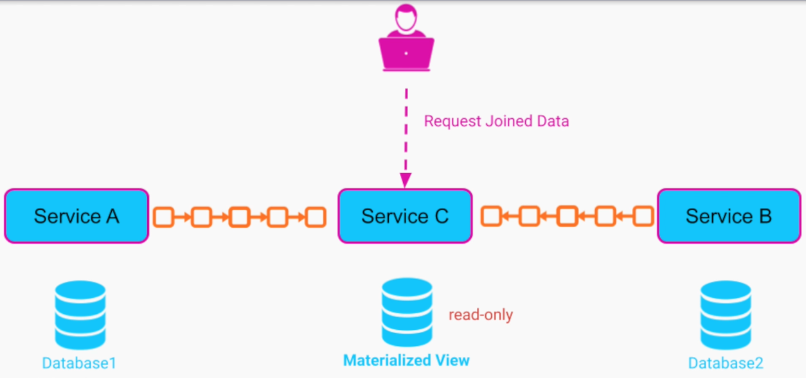
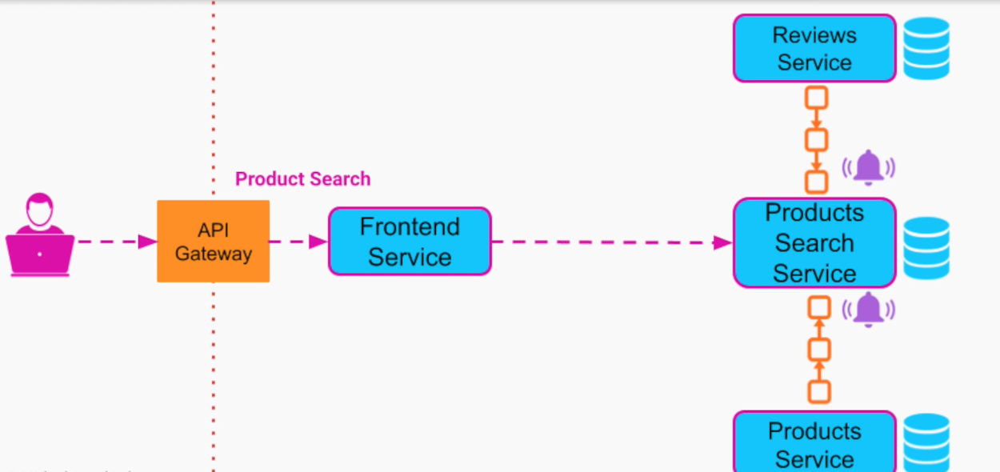

# Materialized View

- A read-only database that is populated based on the events coming from multiple other databases
- This way, all the information that the service needs to operate is contained in itself and there is no need to perform multiple integrations
- Materialized View is usually applied in conjunction with CQRS

