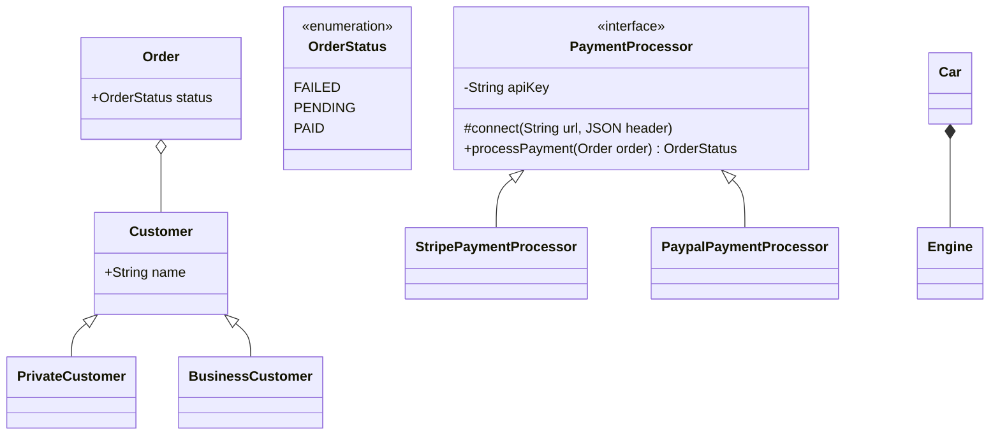

# Class Diagram

```mermaid
classDiagram
  class Order {
    +OrderStatus status
  }

  class OrderStatus {
    <<enumeration>>
    FAILED
    PENDING
    PAID
  }

  class PaymentProcessor {
    <<interface>>
    -String apiKey
    #connect(String url, JSON header)
    +processPayment(Order order) OrderStatus
  }

  class Customer {
    +String name
  }

  %% Inheritance Relationship
  PaymentProcessor <|-- StripePaymentProcessor
  PaymentProcessor <|-- PaypalPaymentProcessor
  Customer <|-- PrivateCustomer
  Customer <|-- BusinessCustomer

  %% Aggregation Relationship (Customer can exist independently of the Order)
  Order o-- Customer

  %% Composition Relationship (Engine cannot exist without the car, it's part of it)
  Car *-- Engine
```
