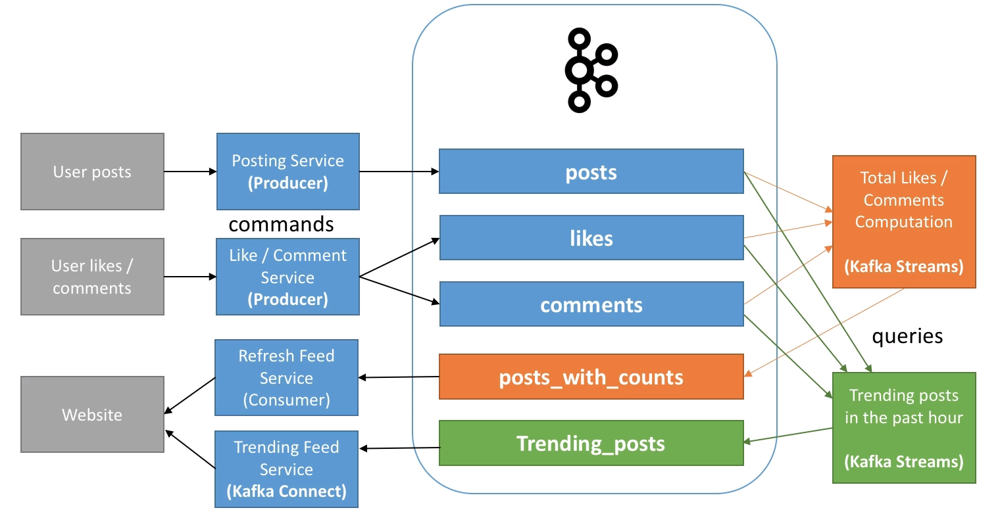

# Command Query Responsibility Segregation (CQRS)

- Responsabilities for the data aggregation (`command` and `query`) are segregated
- It's good for optimizing a database that has both high read and write operations

## Command Operation

- `Write operations` (update, create, delete)
- The write database take place in a master database, it receives all the write operations and replicate it to the read database

## Query Operation

- Read operations (select)
- Have a database optimized for read only operations

## Sync strategies

- The sync between the command and the query databases can be done by listening to the `Redo Log` from the master database
  - This way, there are no read operations to the command database

- Ways to sync the data
  - `Automatic`: synchronously sync the databases on every state state. Slow!
  - `Eventual`: asynchronously sync the databases on every state state
  - `Controlled`: sync operation is scheduled
  - `On Demand`: sync is performed when the data is requested

## Consistency

- `Eventual consistency`: updates from time to time, not immediately
- `Strong consistency`: updates on every change immediately (very difficult because there is still a small delay)
