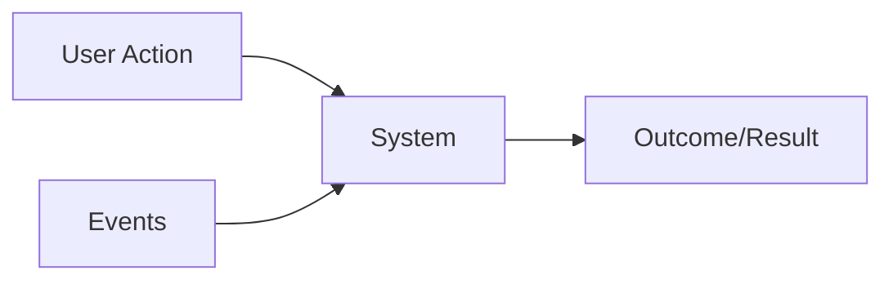

# Requirements

- `Requirements` is a formal description of how the system should behave
- It's important to raise the right requirements because changes in large systems are expensive (engineers, contracts, reputation, brand)
- Requirements are the `architectural drivers`

## Gathering requirements

- The client (who demands the feature) usually do not know what they need (the requirement), but they know `what they want to solve`
  - Allow people to join drivers on a route, who are willing to take passengers for a fee
  - A system that allows sharing of large files between users.
- What problem is being solved here?

- `Make the right questions` to solve the problem!

## Classification

### Feature Set (`Functional Requirements`)

- It's a `must do`
- Requirements that define the target feature
- Results may be triggered by either user actions or events
- Functional requirements DO NOT influence on the architecture, since a feature can be implemented using any kind of architecture (just it may not be viable)

- **Examples**
  - User must have access to the e-commerce platform
  - User must be able to search an item
  - After a user uploads a file, they will get a unique link that they can share with other users. Any user with that link can download the file.

### System Quality Attributes (`Non-Functional Requirements`)

- It's a `must have`
- It's a quality measure on how well the system perform on a particular dimension
- Non-functional requirements DO influence on the architecture
- Quality attributes need to be `measurable` and `testable`
  - Example of a bad attribute definition: "it must be fast!"
- Quality attributes may contradict one another, we need to make the right `tradeoff`
- Unrealistic requirements must be `called out` as soon as possible
  - Example: < 100 ms latency between South America and Asia. 100% availability

- **Examples**
  - `Latency`: user must be able to check the account balance within 1 s
  - `Scalability`
  - `Flexibility`
  - `Availability`: the online store must be available to the users at least 99.9% of the time
  - `Speed`: download speeds should be at least 50 Mbit/s
  - `Deployability`: the dev must be able to deploy a new version at least twice a week

### System Constraints

- Limitations and boundaries
- System constraints requirements DO influence on the architecture
- System constraints are not necessarily a bad thing, it helps narrowing down the scope
- They provide us with a solid starting point
- Usually 3 types
  - **Technical constraints**
    - Being locked to a particular hardware/cloud vendor
    - Having to use a particular programming language
    - Having to use a particular database technology
    - Having to support a platform X
    - Having to support low-end mobile devices
    - Having a limited skillset of engineers
  - **Business constraints**
    - Time constraints, strict deadlines
    - Financial constraints, limited budget
    - Use specific external partners/carriers
    - Staffing constraints, small number of available engineers
  - **Legal/regulatory constraints**
    - GDPR (data protection)
    - HIPAA (medical)

### Extended Requirements

- Browsing data has to be saved for future analytics
